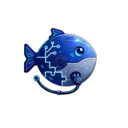

[中文版](docs/zh/README.md)

<p align="center">
  
</p>

# PEtFiSh
<p align="center">
  
</p>
**Your AI Companion**
From first commit to final delivery, PEtFiSh is always there.
```text
><(((^>  PEtFiSh v1.5

Always Present   Companion Gateway in every interaction
Guarding         Sense gaps, guard context, block pollution
Verified Trust   Lint + audit + red lines = earned trust
No Compromise    No sycophancy, standards don't bend

/petfish — your always-on companion
```

Not a toolbox. A companion. Tools get called. PEtFiSh is always there.

📖 **[Documentation](https://docs.petfish.ai)** — Getting Started, Guides, Pack Reference, Developer Docs

---

## Quick Start
1. Install `init` and `companion`.
2. Run `/initproject` in your project.
3. Pick a profile; PEtFiSh installs matching packs.
4. Start working; Companion Gateway is now active.
**Recommended one-line install**
```text
Install PEtFiSh by following: https://raw.githubusercontent.com/kylecui/petfish.ai/master/docs/agent-install.md
```

**Unified Python installer (recommended)**
```bash
uv run https://raw.githubusercontent.com/kylecui/petfish.ai/master/install.py --pack init,companion --detect
```

**Legacy shell installers (deprecated)**

Windows PowerShell:
```powershell
& ([scriptblock]::Create((irm https://raw.githubusercontent.com/kylecui/petfish.ai/master/remote-install.ps1))) -Pack "init,companion" -Detect
```

macOS / Linux / WSL:
```bash
curl -fsSL https://raw.githubusercontent.com/kylecui/petfish.ai/master/remote-install.sh | bash -s -- --pack init,companion --detect
```

---

## Companion Gateway
Companion Gateway runs before every message:
1. **Mode Read** — load project depth/rigor settings.
2. **Topic Check** — detect drift and assess context risk.
3. **Failure Signal Detection** — catch previous-turn errors and recommend fixes.
4. **Skill Sense** — detect capability gaps before they hurt.
5. **Anti-Sycophancy Check** — pause before agreeing with evaluative questions.
6. **Proceed** — continue with the right context in place.
See [docs/companion-gateway.md](docs/companion-gateway.md) for the full flow.

---

## `/petfish` Commands
| Command | Purpose |
|---|---|
| `/petfish` | Show installed pack and skill status |
| `/petfish catalog` | Browse available packs and skills |
| `/petfish suggest` | Recommend packs from project structure |
| `/petfish install <alias>` | Get the install command for a pack |
| `/petfish detect` | Detect the current AI platform |
| `/petfish search <keyword>` | Search skills and MCP servers across sources |
| `/petfish mine <repo>` | Mine a repository for skill candidates |
| `/petfish create <name>` | Scaffold a new skill |
| `/petfish lint [path]` | Run format and quality checks |
| `/petfish audit <path>` | Run a security audit |
| `/petfish gate <path>` | Run the full publish gate |
| `/petfish optimize <path>` | Improve skill descriptions and triggers |
| `/petfish eval <path>` | Test trigger accuracy |
| `/petfish stats` | View usage analytics |
| `/petfish upgrade` | Show upgrade command for installed packs |
| `/petfish uninstall <alias>` | Show uninstall command (local installer only) |

---

## Built-in Skills
### 2 Core Companion Skills (`companion` pack)
```text
fish-brain   — Orchestration, sensing, and routing (鱼伴)
fish-market  — Search across external sources (鱼市)
```

| Skill | Purpose | Script |
|---|---|---|
| `fish-brain` | Orchestration, sensing, and routing | `catalog_query.py`, `check_installed.py`, `detect_platform.py` |
| `fish-market` | Search across external sources | `marketplace_search.py` |

### 9 Toolchain Skills (`toolchain` pack)
```text
Skill Lifecycle Pipeline

mine → author → lint → audit → gate → publish → optimize → eval

+ skill-usage-tracker
```

| Skill | Purpose | Script |
|---|---|---|
| `skill-author` | Scaffold new skills | `generate_skill.py` |
| `skill-lint` | Format and quality checks | `lint_skill.py` |
| `repo-skill-miner` | Mine repositories for skill candidates | `mine_repo.py` |
| `skill-security-auditor` | Static security analysis | `audit_skill.py` |
| `quality-gate` | Publish decision pipeline | `run_gate.py` |
| `skill-publish` | Bridge gate PASS → market availability | `publish.py` |
| `skill-description-optimizer` | Improve descriptions and triggers | `optimize_description.py` |
| `skill-trigger-evaluator` | Measure trigger precision and recall | `evaluate_triggers.py` |
| `skill-usage-tracker` | Usage analytics and feedback | `track_usage.py` |

---

## 4 Core Packs (included in every install)
| Alias | Purpose | Scale |
|---|---|---|
| `init` | Project initializer and `/initproject` wizard | Global default |
| `companion` | Companion Gateway, `/petfish`, and 2 core skills (fish-brain, fish-market) | Global default |
| `petfish` | Writing style and rewrite guidance | Global default |
| `toolchain` | Skill lifecycle pipeline — 9 skills for authoring, linting, auditing, publishing, and market distribution | Global default |

## 10 Optional Packs (via petfish-market)
> Optional packs are distributed through [petfish-market](https://github.com/kylecui/petfish-market). Install commands resolve automatically — no user-visible difference.
| Alias | Purpose | Scale |
|---|---|---|
| `course` | Course outline, content, labs, QA, and QC workflows | Project |
| `testdocs` | Test case and usage documentation workflows | Project |
| `deploy` | Deployment, CI/CD, health check, rollback, and ops workflows | Project |
| `ppt` | Slide and presentation workflows | Project |
| `calibrate` | Anti-sycophancy review and decision calibration | Project |
| `context` | Topic governance, context isolation, and contamination scoring | Project |
| `trust` | Skill trust governance and policy checks | Project |
| `research` | Research workbench — evidence-backed scientific, product, and planning research | Project |
| `reflect` | Structured reflection — capture what went wrong, why, and corrective actions | Project |
| `doc-reader` | Document-to-Markdown conversion — PDF/DOCX/XLSX/HTML/PPTX reading via markitdown | Project |

## Profile → Auto-Install Mapping
| Profile | Auto-installed Packs |
|---|---|
| `minimal` | `context`, `petfish` |
| `course` | `context`, `course`, `doc-reader`, `petfish` |
| `code` | `context`, `deploy`, `petfish`, `testdocs` |
| `ops` | `context`, `deploy`, `petfish` |
| `security` | `context`, `deploy`, `petfish`, `testdocs`, `trust` |
| `research` | `context`, `doc-reader`, `petfish`, `research` |
| `writing` | `context`, `petfish`, `ppt` |
| `skills-package` | `context`, `petfish`, `testdocs` |
| `comprehensive` | `context`, `course`, `deploy`, `doc-reader`, `petfish`, `ppt`, `testdocs`, `trust`, `research`, `reflect` |

---

## Platform Support
| Platform | `--platform` | Skills Directory | Instructions File | Auto-detect Markers |
|---|---|---|---|---|
| OpenCode | `opencode` | `.opencode/skills/` | `AGENTS.md` | `.opencode/`, `opencode.json` |
| Claude Code | `claude` | `.claude/skills/` | `CLAUDE.md` | `.claude/`, `CLAUDE.md` |
| Codex | `codex` | `.agents/skills/` | `AGENTS.md` | `.codex/` |
| Cursor | `cursor` | `.cursor/skills/` | `.cursor/rules/*.mdc` | `.cursor/`, `.cursorrules` |
| GitHub Copilot | `copilot` | `.github/skills/` | `.github/copilot-instructions.md` | `.github/copilot-instructions.md` |
| Windsurf | `windsurf` | `.windsurf/skills/` | `.windsurfrules` | `.windsurf/`, `.windsurfrules` |
| Antigravity | `antigravity` | `.agents/skills/` | `AGENTS.md` + `GEMINI.md` | `.agents/`, `GEMINI.md` |
| Universal | `universal` | `.agents/skills/` | `AGENTS.md` | Fallback |

---

## Install Commands

### Unified Python Installer (Recommended)
```bash
# Remote one-liner (requires uv)
uv run https://raw.githubusercontent.com/kylecui/petfish.ai/master/install.py --pack <alias> [--target .] [--platform opencode] [--detect] [--force] [--global]

# List available packs
uv run https://raw.githubusercontent.com/kylecui/petfish.ai/master/install.py --list

# Offline install from cloned repo
uv run ./install.py --pack <alias> --offline

# With GitHub token (private repos / rate limit)
uv run ./install.py --pack <alias> --github-token $GITHUB_TOKEN

# Uninstall
uv run ./install.py --uninstall --pack <alias> --target .
```

Supports all 8 platforms, 28 pack aliases, community packs (`community/owner/repo`), mirror fallback for China networks, and full uninstall.

### Legacy Shell Installers (Deprecated)

> ⚠ The shell installers (`install.sh`, `install.ps1`, `remote-install.sh`, `remote-install.ps1`) are deprecated in favor of `install.py`. They will be removed in a future release.

```powershell
& ([scriptblock]::Create((irm https://raw.githubusercontent.com/kylecui/petfish.ai/master/remote-install.ps1))) -Pack <alias> [-Target .] [-Platform opencode] [-Detect] [-Force] [-Global]
```

```bash
curl -fsSL https://raw.githubusercontent.com/kylecui/petfish.ai/master/remote-install.sh | bash -s -- --pack <alias> [--target .] [--platform opencode] [--detect] [--force] [--global]
```

### Offline / Network-Restricted Install

1. Clone or download the repo: `git clone https://github.com/kylecui/petfish.ai.git`
2. Run the unified installer:
   ```bash
   uv run ./install.py --pack <alias> --offline
   ```
   Or use the legacy local installers:
   ```powershell
   .\install.ps1 -Pack <alias> -Platform <PLATFORM> -Target .
   ```
   ```bash
   ./install.sh --pack <alias> --platform <PLATFORM> --target .
   ```

The installer works offline — it scans `packs/` locally. `platforms.json` is recommended but optional (hardcoded fallback exists).

For China network: mirror fallback via `ghfast.top` → `ghproxy.com` with 3 retries.

See [docs/agent-install.md](docs/agent-install.md) for full install instructions.

---

## Upgrade
Run `/petfish upgrade` to see the upgrade command for your OS, or re-run the install command with `--force`:
```text
Upgrade PEtFiSh by following: https://raw.githubusercontent.com/kylecui/petfish.ai/master/docs/agent-upgrade.md
```

```bash
uv run https://raw.githubusercontent.com/kylecui/petfish.ai/master/install.py --pack all --force
```

Legacy shell upgrade:
```powershell
& ([scriptblock]::Create((irm https://raw.githubusercontent.com/kylecui/petfish.ai/master/remote-install.ps1))) -Pack all -Force
```

```bash
curl -fsSL https://raw.githubusercontent.com/kylecui/petfish.ai/master/remote-install.sh | bash -s -- --pack all --force
```

Without `--force`, current packs are skipped, available updates are reported, and missing packs still install normally.

---

## Global vs Project Install

- **Global** (`--global`): installs skills and commands to the user-level directory. `init` and `companion` default to global.
- **Project** (default): installs to the target project's platform-specific directory with instructions merge, config merge, and registry tracking.

---

## Quality Gate Pipeline
```text
skill/
  │
  ├─ 1. Lint
  │    └─ Score ≥ 80/100
  │
  ├─ 2. Security Audit
  │    └─ Risk ≤ 0.5 and no CRITICAL
  │
  ├─ 3. Metadata Validation
  │    └─ Name, version, and description valid
  │
  └─ 4. Decision
       ├─ PASS
       ├─ CONDITIONAL
       └─ FAIL
```

```bash
uv run .opencode/skills/quality-gate/scripts/run_gate.py --path .opencode/skills/my-skill/
uv run .opencode/skills/quality-gate/scripts/run_gate.py --path .opencode/skills/ --recursive
```

---

## Prerequisites
- **`uv`** — required for all Python-based skills, MCP servers, and scripts with external dependencies. PEtFiSh uses uv as its sole Python environment manager. MCP servers are launched via `uv run`, standalone scripts use PEP 723 inline metadata or pack-level `pyproject.toml`. No `pip install` is used anywhere. The installer warns when `uv` is missing.
- `python3` — used by installers for stdlib-only JSON parsing and instructions translation (no virtual environment needed)

---

## Adding a New Pack
1. Decide: `packs/core/` (shipped on petfish.ai) or `packs/optional/` (distributed via petfish-market).
2. Create a directory under the appropriate location.
3. Add `.opencode/` with `skills/`, `commands/`, and/or `agents/`.
4. Add `pack-manifest.json`.
5. Add `AGENTS.md` content for merge into the target instructions file.
6. Add `opencode.example.json` if OpenCode config merge is needed.
7. Register the alias in the installer scripts.
8. For optional packs: register in petfish-market `registry/official/` and update `index.json`.

---

## Repo Structure
```text
petfish.ai/
├── packs/
│   ├── core/                                     # 4 core packs, shipped on petfish.ai
│   │   ├── project-initializer-skill/            # init
│   │   ├── petfish-companion-skill/              # companion
│   │   │   └── .opencode/skills/
│   │   │       ├── fish-brain/                   # orchestration and sensing (鱼伴)
│   │   │       └── fish-market/                  # external search (鱼市)
│   │   ├── petfish-style-skill/                  # petfish
│   │   └── petfish-toolchain-skill/              # toolchain
│   │       └── .opencode/skills/
│   │           ├── skill-author/                 # scaffolding
│   │           ├── skill-lint/                   # quality checks
│   │           ├── repo-skill-miner/             # repo mining
│   │           ├── skill-security-auditor/       # security audit
│   │           ├── quality-gate/                 # publish gate
│   │           ├── skill-publish/                # market publishing
│   │           ├── skill-description-optimizer/  # description tuning
│   │           ├── skill-trigger-evaluator/      # trigger testing
│   │           └── skill-usage-tracker/          # usage analytics
│   └── optional/                                 # 10 optional packs, distributed via petfish-market
│       ├── opencode-course-skills-pack/          # course
│       ├── opencode-skill-pack-testcases-usage-docs/ # testdocs
│       ├── repo-deploy-ops-skill-pack/           # deploy
│       ├── opencode-ppt-skills/                  # ppt
│       ├── anti-sycophancy-calibration-pack/     # calibrate
│       ├── fish-trail/                           # context
│       ├── trustskills-governance-pack/          # trust
│       ├── research-skill-pack/                  # research
│       ├── fish-reflection-pack/                 # reflect
│       └── doc-reader-skill/                     # doc-reader
├── platforms.json                                # platform registry
├── install.py                                    # unified Python installer (recommended)
├── install.ps1                                   # local PowerShell installer (deprecated)
├── install.sh                                    # local shell installer (deprecated)
├── remote-install.ps1                            # remote PowerShell installer (deprecated)
├── remote-install.sh                             # remote shell installer (deprecated)
└── README.md
```

---

## Version History
### v1.5 — Unified Python Installer

- **v1.5.0**: Replace 4 shell installers (install.sh, install.ps1, remote-install.sh, remote-install.ps1) with single `install.py` distributed via `uv run <url>`. Zero external dependencies (stdlib only). Full feature parity: 8 platforms, 28 pack aliases, AGENTS.md marker merge, opencode.json deep merge, L1 rules files, plugin/MCP deployment, instruction translation, market download, community packs, mirror fallback, uninstall, v0.9→v1.4 migration, Claude Code hooks. Shell installers deprecated with migration notices.

### v1.4 — Market-First Distribution

- **v1.4.6**: Market-first download in local installers — both install.sh and install.ps1 now query petfish-market for optional packs not found locally, with mirror fallback and --offline flag. Fix #193: redirect community pack status messages to stderr in bash installers.
- **v1.4.5**: All 9 optional packs decoupled to independent GitHub repos (Phase 3+4). Course, research, testdocs, ppt, deploy join the 4 single-skill packs from v1.4.3/v1.4.4. Market index updated; all packs now independently versioned. `packs/optional/` retained in monorepo as local staging/development location.
- **v1.4.4**: Fix EXTRACT_DIR regression — exclude community-staging from find command (#193 followup). Phase 2 decoupling: fish-reflection, anti-sycophancy, trustskills-governance → independent repos.
- **v1.4.3**: Fix COMMUNITY_STAGING unbound variable when installing community packs (#193). Phase 1 pilot: petfish-style-skill decoupled to kylecui/petfish-pack-petfish-style.
- **v1.4.2**: Docs sync — v1.4.1 version history in README + REPO-LANDSCAPE.md dependency table update.
- **v1.4.1**: Wire market-first resolution into remote installers. `resolve_pack()` / `Resolve-PackName()` now query petfish-market `index.json` for optional (non-core) packs and cache metadata (`repo`/`ref`/`path`/`version`) for the download phase. Core packs always resolve from the main petfish.ai tarball. Bash installer adds external-repo download support via `MARKET_PACK_DIRS` — when an optional pack's market entry points to a repo other than petfish.ai, it is downloaded separately. Silent fallback to hardcoded ALIASES when market is unreachable.
- **v1.4.0**: packs/ restructured into `core/` (4 packs: init, companion, petfish, toolchain) and `optional/` (9 packs: course, testdocs, deploy, ppt, calibrate, context, trust, research, reflect). Optional packs distributed via petfish-market with auto-resolution in installers. New toolchain skill `skill-publish` bridges quality-gate PASS → market availability. Remote installers add market query hooks (`query_market_index()` / `Query-MarketIndex`). `catalog_query.py` gains `--install <alias>` flag and market awareness. `marketplace_search.py` prioritizes petfish-market source. petfish-market adds `registry/official/` with 9 official pack entries and `index.json` v2.

### v1.3 — Module Decomposition: Companion + Toolchain Split

- **v1.3.0**: Extract 8 toolchain skills from `companion` into new `toolchain` pack (`petfish-toolchain-skill`); rename `petfish-companion` → `fish-brain` (鱼伴) and `marketplace-connector` → `fish-market` (鱼市); `companion` pack now ships 2 core skills only; total packs 12 → 13, total skills unchanged at 96.

### v0.11 — Companion Gateway Enhancement: Proactive Intelligence

- **v0.11.7**: Documentation catchup — companion-gateway docs (EN+ZH), README, website updated to reflect 6-step Gateway flow; Token Cost Engineering blog post published.
- **v0.11.6**: Companion Gateway 6-step implementation complete — all six steps (Mode Read, Topic Check, Failure Signal Detection, Skill Sense, Anti-Sycophancy Check, Proceed) integrated and operational.
- **v0.11.5**: Rigor threshold refinement — only Momus plan+review for 3+ step or 3+ file tasks; simpler tasks get assumption-stating and post-verification without formal plan files.
- **v0.11.4**: Anti-Sycophancy Check (Step 2.5) — rubric-first evaluation, mandatory counter-argument search before agreeing; proactivity level linked to Rigor mode (off=explicit only, on=implicit+assertions).
- **v0.11.3**: Rigor Mode — `rigor: true` in project-mode.yaml adds plan-then-review discipline: formal plan files for complex tasks, Momus review before implementation, explicit assumption-stating. Forced on when `depth: thorough`.
- **v0.11.2**: Project Mode (Step 0) — `depth` (urgent/balanced/thorough) and `rigor` (on/off) axes in `.opencode/project-mode.yaml`; session-only verbal overrides without file writes.
- **v0.11.1**: Failure Signal Detection (Step 1.5) — scan previous assistant turn for known failure patterns (PDF/deploy/test/research/context), recommend matching pack if uninstalled. Implemented via `catalog_query.py --check-failures`.
- **v0.11.0**: Gateway expansion from 3 steps to 6 steps — add Mode Read, Failure Signal Detection, and Anti-Sycophancy Check to the always-on Companion Gateway flow.

### v0.10 — Research Pack Expansion: 7 Domains

- **v0.10.10**: Auto-update capability — `check_installed.py --check-updates` queries GitHub latest release and compares installed pack versions; `catalog_query.py --upgrade` shows OS-appropriate upgrade command; Companion Gateway now checks for updates on session start; `/petfish upgrade` command added. Also fixes missing `research` alias in `KNOWN_PACKS`.
- **v0.10.9**: Systemic trigger keyword coverage fix — align all skill descriptions with body trigger words across all 11 packs (~74 skills updated); add `check_trigger_coverage()` lint rule to `lint_skill.py`; integrate trigger-coverage into `run_gate.py` decision logic; add Description-Body alignment discipline to root AGENTS.md; expand research triggers in `catalog_query.py`. Closes #91, #89, #88.
- **v0.10.7–v0.10.8**: Fix research pack integration — complete 9-touchpoint checklist for research pack (remote installer, companion catalog, README, docs, website). Crystallize "one audit, one fix" development lesson.
- **v0.10.6**: Fix 4 backlog issues — replace duplicate QA script with qa_scan.py (#80), add `--target` to suggest for fixture isolation (#73), document JSONL/Markdown design and improve research pack UX (#79), add hybrid semantic+keyword trigger scoring with `--semantic` flag (#77). Closes #80, #73, #79, #77.
- **v0.10.5**: Adapter skills — 4 lightweight domain adapters (travel-adapter, conference-adapter, training-event-adapter, content-selection-adapter) that enhance main research chains with domain-specific fields and checklists. Trigger evals, smoke test coverage. Pack now has 50 skills.
- **v0.10.4**: Risk-procurement and experience-event research domains — 11 new skills (risk-research-brief, vendor-source-diligence, security-risk-review, compliance-check, tco-operational-risk, adoption-recommendation, experience-brief-framer, venue-destination-research, schedule-itinerary-planner, logistics-risk-planner, event-runbook-writer), trigger evals, smoke test coverage. Pack now has 46 skills.
- **v0.10.3**: Learning and decision research domains — 7 new skills (learning-goal-framer, learning-resource-discovery, learning-path-designer, decision-brief-framer, decision-criteria-builder, option-comparison-matrix, decision-recommendation), trigger evals, smoke test coverage. Pack now has 35 skills.
- **v0.10.2**: Planning research domain — 6 new skills (environment-scanner, stakeholder-analyst, scenario-planner, policy-researcher, technology-assessor, roadmap-developer), trigger evals, smoke test coverage. Pack now has 28 skills.
- **v0.10.1**: SKILL_builder eradication — 10 stale refs fixed across 6 files; catalog_query.py fallback now returns actual counts. Closes #87, #86.
- **v0.10.0**: Product research domain — 5 new skills (user-research, competitor-analysis, opportunity-mapper, validation-planner, decision-brief), trigger evals, smoke test coverage. Pack now has 22 skills.

### v0.9 — Research Skill Pack

- **v0.9.6**: Fix smoke fixture missing adr/ directory (#85); fix trigger eval runner to glob all evals/trigger/*.json (#84).
- **v0.9.5**: Fix SKILL.md schema mismatches in 4 research skills (#83, #82, #78); fix repo_inventory.py node_modules inclusion (#81); fix all 4 installers writing zeroed skill/command/agent counts (#71). Closes 5 issues.
- **v0.9.4**: Research pack scientific domain — 7 new skills (citation-auditor, literature-review, gap-finder, methodology-designer, experiment-planner, paper-writer, review-rebuttal), trigger evals, smoke test coverage. Pack now has 17 skills.
- **v0.9.3**: Research pack installable — pack-manifest, installer registration, companion catalog integration, README and CHANGELOG updates.
- **v0.9.2**: Research pack QA infrastructure — seeded fixtures, E2E smoke tests (15 pytest), trigger-eval harness, local smoke runner, CI gates. Closes #74, #75, #76.
- **v0.9.1**: Research alias added to all 4 installers and companion catalog.
- **v0.9.0**: Research skill pack MVP — 10 core skills, 7 JSON schemas, 9 Python scripts, pack infrastructure.

### v0.8 — Multi-Platform & Agent Discipline

- **v0.8.1**: Universal agent principles (cross-repo protection, network retry); complete ops AGENTS.md template (11 sections); code profile experience crystallization (Development Gotchas, Architecture Decisions); deployment-executor references for private repo access and local patch management. Closes #66, #67, #68, #69.
- **v0.8.0**: Multi-platform instruction file generation (#63) — `detect_all_platforms()`, content condensation for token-limited platforms, Claude Code hook scripts, uv-first Python policy enforced across project.

### v0.7 — Stability & Pack Versioning

- **v0.7.2**: Fix #57 root cause (`grep -qF` replacing `echo | grep`); fix #65 (8 missing QA bilingual terms in topic_detector.py).
- **v0.7.1**: Fix #57 legacy name awareness in merge_agents_md; bump fish-trail and petfish-companion-skill to 1.0.0 (#64); fix corrupted AGENTS.md markers; update all 4 installer scripts.

### v0.6 — Companion Narrative

- **v0.6.4**: Bilingual website and docs; archive outdated v0.2 docs.
- **v0.6.3**: Companion narrative rebrand; fix #57 `--force` upgrade bug.
- **v0.6.2**: Fix companion pack skill sensing, installer dedup, catalog fallback, and universal platform detection.
- **v0.6.1**: Fix `topic_graph` persistence, schema alignment, and intent-aware skill sensing.
- **v0.6.0**: Companion Gateway with always-on topic check, 3-tier skill sense, and debug mode.

### v0.5 — Fish Trail and Repo Rename

- **v0.5.4**: Fix missing `version` field in `topic_graph` and stale detection in `topic_report`.
- **v0.5.3**: Add the agent upgrade guide and web upgrade prompt.
- **v0.5.2**: Add the v0.4.x → v0.5.x upgrade guide.
- **v0.5.1**: Pre-release documentation and test suite updates.
- **v0.5.0**: Rename `SKILL_builder` to `petfish.ai`; rename the context router pack to `fish-trail`; add 31 MCP tools, installer aliases, state directory migration, and topic routing scripts.

### v0.4 — Context Router and Session Management

- **v0.4.0**: Add the context router pack with topic detection, contamination scoring, context isolation, and 18 MCP tools.
- **v0.4.5–v0.4.9**: Fix MCP schema issues, platform-specific restart hints, CJK detection, and trigger evaluation.
- **v0.4.10**: Add topic-aware session management with 10 new MCP tools, cross-session resume, boundary policy, activity query, agent attribution, and topic recommendations.
- **v0.4.11–v0.4.12**: Fix install guidance, trigger extraction scope, and `deploy_dirs` false positives.

### v0.3 — Quality and Platform Hardening

- Anti-sycophancy calibration pack.
- Style v4 AI slop detection.
- Release discipline with auto-resolved latest release tags.
- UTF-8 fixes for PowerShell.
- Comma-separated multi-pack install.

### v0.2 — Skill Lifecycle Management

- **Phase 1**: 8-platform adapter and companion skill with sensing, equip, and governance capabilities.
- **Phase 2**: Marketplace search, skill authoring, and quality linting.
- **Phase 3**: Repo mining, security audit, and publish quality gate.
- **Phase 4**: Description optimization, trigger evaluation, and usage tracking.

### v0.1 — Skill Installer

- Multi-pack installer with remote install support.
- 7 skill packs: `course`, `deploy`, `testdocs`, `petfish`, `ppt`, `init`, and `companion`.

---

## License

Apache-2.0 — see [LICENSE](LICENSE).

The names **胖鱼**, **PEtFiSh**, **petfish**, **petfish.ai**, and the PEtFiSh logo are trademarks not covered by the license. See [TRADEMARKS.md](TRADEMARKS.md).

---

PEtFiSh — your AI companion in every interaction.
