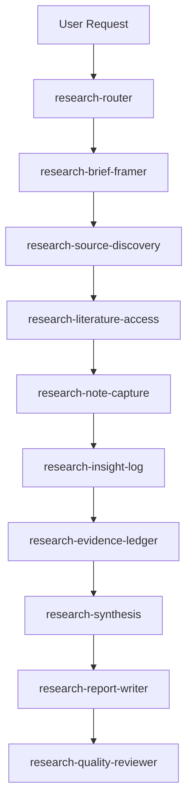

# Research Skill Pack Guide

The **PEtFiSh Research Skill Pack** transforms vague research tasks into traceable, evidence-backed, and quality-reviewed outputs. Instead of relying on a single prompt to generate a hallucination-prone summary, this pack breaks the research process down into structured, rigorous steps. 

With **54 specialized skills** spanning **8 research domains**, it enforces a simple rule: *Evidence first. Every claim traces back to a source.*

---

## Quick Start: Install

Install the research pack globally using the PEtFiSh remote installer:

=== "Windows PowerShell"

    ```powershell
    & ([scriptblock]::Create((irm https://raw.githubusercontent.com/kylecui/petfish.ai/master/remote-install.ps1))) -Pack research
    ```

=== "macOS / Linux / WSL"

    ```bash
    curl -fsSL https://raw.githubusercontent.com/kylecui/petfish.ai/master/remote-install.sh | bash -s -- --pack research
    ```

---

## Quick Start: Research in 5 Steps

Want to research a topic right now? Here is the fastest way to use the pack:

1. **Trigger the Router**: Tell your AI, `"Research [your topic]"` or `"Help me investigate [problem]"`.
2. **Review the Brief**: The agent uses `research-brief-framer` to define the core questions, scope, and boundaries.
3. **Gather Evidence**: The agent finds sources (`research-source-discovery`) and captures notes (`research-note-capture`).
4. **Synthesize**: Notes are converted into an Evidence Ledger, then synthesized into structured findings (`research-synthesis`).
5. **Generate & Review**: The agent writes the final report (`research-report-writer`) and runs an independent audit (`research-quality-reviewer`) before showing you the final result.

---

## The Core Research Chain

At the heart of the pack is the **Core Research Chain**, a sequence of skills designed to prevent AI hallucinations by separating data gathering, synthesis, generation, and review.



!!! tip "Separation of Duties"
    Generation and review are strictly separated. The `research-quality-reviewer` always runs *after* the report is drafted to catch unsupported claims, logic gaps, or AI slop.

### Step-by-Step Walkthrough

Let's look at how a real research task flows through the chain. Suppose you ask: *"Research the current state of WebAssembly in backend development."*

#### 1. Router & Brief Framer
The system first categorizes your request and defines the boundaries of the research.

=== "Prompt"
    ```text
    Research the current state of WebAssembly (Wasm) in backend development. Is it ready for production?
    ```

=== "Output: 00_brief/wasm_backend_brief.md"
    ```markdown
    # Research Brief: WebAssembly in Backend
    
    **Core Question:** Is WebAssembly mature enough for backend production workloads?
    **Scope Boundaries:** Focus on server-side runtimes (Wasmtime, WasmEdge), language support, and containerization. Exclude browser-based Wasm.
    **Evidence Requirements:** Look for production case studies, benchmark data, and CNCF landscape reports.
    ```

#### 2. Source Discovery & Access
The agent searches for high-quality, verifiable sources.

=== "Prompt"
    ```text
    Find sources based on the Wasm backend brief.
    ```

=== "Output: 01_sources/sources.jsonl"
    ```jsonl
    {"source_id": "src_001", "url": "https://cncf.io/reports/wasm-2025", "authority": "High", "status": "accessed"}
    {"source_id": "src_002", "url": "https://github.com/bytecodealliance/wasmtime", "authority": "High", "status": "accessed"}
    {"source_id": "src_003", "url": "https://blog.example.com/wasm-hype", "authority": "Low", "status": "rejected"}
    ```

#### 3. Note Capture & Insights
The agent reads the sources and extracts exact quotes and findings.

=== "Prompt"
    ```text
    Read the accessed sources and capture notes.
    ```

=== "Output: 02_notes/notes.jsonl"
    ```jsonl
    {"note_id": "note_001", "source_id": "src_001", "quote": "Wasmtime execution speed has improved 40% year over year.", "type": "EXTRACTED"}
    {"note_id": "note_002", "source_id": "src_002", "quote": "Component Model is still in draft phase.", "type": "EXTRACTED"}
    ```

#### 4. Evidence Ledger & Synthesis
The notes are elevated into an evidence ledger, then synthesized into key findings.

=== "Prompt"
    ```text
    Synthesize the notes into a structured matrix.
    ```

=== "Output: 05_analysis/synthesis_matrix.md"
    ```markdown
    ## Synthesis Matrix
    
    | Finding | Confidence | Supporting Evidence | Contradictions |
    |---------|------------|---------------------|----------------|
    | Execution speed is production-ready | High | `ev_001`, `ev_004` | None |
    | Component Model tooling is mature | Low | None | `ev_002` states it is in draft |
    ```

#### 5. Report Writer & Quality Review
The agent drafts the report based *only* on the synthesis, then an independent reviewer checks the claims.

=== "Prompt"
    ```text
    Draft the final report and run a quality review.
    ```

=== "Output: 07_reviews/qa_report.md"
    ```markdown
    # Quality Review: FAIL
    
    **Issue:** The report claims "Wasm is replacing Docker everywhere."
    **Reason:** No evidence in the ledger supports this. Sources `ev_001` and `ev_003` indicate they are complementary.
    **Action:** Rewrite section 3 to reflect the complementary relationship.
    ```

---

## The 8 Research Domains

The pack adapts to your specific needs by routing your request to one of eight specialized domains. Each domain introduces specific terminology and frameworks.

### 1. Scientific Research
For academic literature, methodology design, and paper writing. This domain brings academic rigor to AI generation.

??? abstract "Scientific Skills Breakdown"
    - `scientific-literature-review`: Conducts systematic reviews, filters inclusion criteria, and builds related work matrices.
    - `scientific-gap-finder`: Differentiates between true research gaps and pseudo-gaps based on verifiable literature.
    - `scientific-methodology-designer`: Translates ideas into falsifiable research designs with clear validity threats.
    - `scientific-experiment-planner`: Maps baselines, ablations, and statistical tests.
    - `scientific-paper-writer`: Generates paper skeletons and contribution framing.
    - `scientific-review-rebuttal`: Performs pre-submission self-reviews across 6 dimensions (novelty, soundness, etc.).

=== "Prompt"
    ```text
    Conduct a systematic literature review on recent advancements in LLM context scaling. Find the research gaps and draft an experiment plan.
    ```
=== "What Happens"
    The agent searches arXiv, extracts methodologies from the top 20 papers, builds a related work matrix, and outputs a falsifiable experiment design targeting the identified gaps.
=== "Prompt 2"
    ```text
    Review this draft paper against the NeurIPS checklist.
    ```
=== "What Happens"
    The `scientific-review-rebuttal` skill audits the draft, checking for reproducibility, soundness, and ethical disclosures, generating point-by-point reviewer feedback.

??? example "Sample Output: Gap Finder"
    ```markdown
    ## Research Gaps Identified
    
    **Gap 1: Long-context Retrieval Degradation (True Gap)**
    - **Current State:** Most models degrade past 32k tokens when needles are placed in the middle of the context (Source: `src_arxiv_2311_1234`).
    - **Proposed Contribution:** A dynamic attention allocation mechanism that weights middle-context blocks higher during retrieval tasks.
    - **Verifiability:** High. Can be benchmarked using the Needle-in-a-Haystack protocol.
    ```

??? example "Sample Output: Experiment Plan"
    ```markdown
    ## Experiment Plan: Dynamic Attention for Long-Context Retrieval

    **Hypothesis:** Dynamically re-weighting attention scores for middle-context positions
    will improve Needle-in-a-Haystack recall by ≥15% at 128k tokens without
    degrading perplexity on standard benchmarks.

    **Variables:**
    - Independent: Attention re-weighting strategy (uniform, linear-decay, learned)
    - Dependent: Retrieval recall@1, perplexity on WikiText-103
    - Controlled: Model size (7B), tokenizer, hardware (8×A100)

    **Baselines:**
    - Vanilla Transformer (no re-weighting)
    - ALiBi positional encoding
    - YaRN context extension

    **Ablations:**
    1. Re-weighting without fine-tuning (zero-shot transfer)
    2. Re-weighting with LoRA fine-tuning on 10k examples
    3. Position-aware vs position-agnostic re-weighting

    **Statistical Tests:** Paired t-test across 5 seeds; report mean ± std.
    **Reproducibility:** All configs in `configs/`, seeds fixed, Docker image provided.
    ```

!!! tip "Use explicit methodology names"
    Instead of saying "research this", say "perform a systematic literature review" or "conduct an ablation study". The skills are tuned to academic terminology.

!!! warning "Common Mistake: Skipping the Literature Matrix"
    Don't jump straight to gap finding. The `scientific-literature-review` builds a structured matrix of existing methods, datasets, and results. Without it, the gap finder has no basis for comparison and will produce superficial "gaps" that already have solutions in the literature.

### 2. Product Research
For user studies, competitor analysis, and market validation. Designed to keep product managers focused on user value rather than feature bloat.

??? abstract "Product Skills Breakdown"
    - `product-user-research`: Designs user interviews, surveys, and usability tests to ground decisions in actual user feedback.
    - `product-competitor-analysis`: Executes systematic competitor discovery, SWOT analysis, and feature matrices.
    - `product-opportunity-mapper`: Evaluates problem spaces using Jobs-to-be-Done (JTBD) and underserved needs scoring.
    - `product-validation-planner`: Designs MVPs and go/kill decision trees.
    - `product-decision-brief`: Synthesizes research into a final go/no-go/pivot document for stakeholders.

=== "Prompt"
    ```text
    Run a competitor analysis on modern CI/CD tools and generate an opportunity map based on user complaints on Reddit and GitHub.
    ```
=== "What Happens"
    The agent builds a feature matrix comparing GitHub Actions, GitLab CI, and CircleCI, scrapes user complaints, and maps them to underserved Jobs-to-be-Done.
=== "Prompt 2"
    ```text
    Design a user interview guide for our new internal developer portal.
    ```
=== "What Happens"
    The `product-user-research` skill generates a screener questionnaire and a structured interview script avoiding leading questions.

??? example "Sample Output: Opportunity Map"
    ```markdown
    ## JTBD Opportunity Score
    
    | Job to be Done | Importance (1-10) | Current Satisfaction (1-10) | Opportunity Score |
    |----------------|-------------------|-----------------------------|-------------------|
    | Debug failing CI pipelines locally | 9 | 3 | **15.0** (High) |
    | Manage cross-repo dependencies | 8 | 5 | **11.0** (Medium) |
    | View build execution logs | 7 | 8 | **6.0** (Low/Overserved) |
    ```

!!! tip "Avoid leading the agent"
    Don't say "prove that our feature is better than Competitor X". Ask the agent to "build an unbiased feature matrix".

??? example "Sample Output: User Interview Guide"
    ```markdown
    ## Interview Guide: Internal Developer Portal

    **Screener Questions:**
    1. Do you use internal tooling daily? (Must be Yes)
    2. Role: Frontend / Backend / DevOps / Other
    3. Tenure: <6 months / 6-24 months / 2+ years

    **Core Questions (30 min):**
    1. Walk me through your last deployment. What tools did you touch?
       - Follow-up: Where did you get stuck?
    2. When you need to find internal documentation, what do you do first?
       - Follow-up: How often does that work?
    3. If you could change ONE thing about your dev workflow, what would it be?
       - Follow-up: What would that save you?

    **Closing:**
    - Is there anything I didn't ask about that you think matters?
    - Would you be willing to test a prototype in 2 weeks?

    **Anti-bias Notes:**
    - Do NOT mention the portal concept until after core questions.
    - Do NOT ask "Would you like a portal?" — this is a leading question.
    ```

!!! warning "Common Mistake: Confirmation Bias in User Research"
    The most dangerous product research mistake is designing studies that confirm what you already believe. The `product-user-research` skill explicitly guards against leading questions, but you must also avoid cherry-picking which user segments to interview. Always include at least one segment that is likely to *disagree* with your hypothesis.

### 3. Planning Research
For strategic roadmaps, environment scanning, and stakeholder alignment. Ideal for quarterly planning and macroeconomic analysis.

??? abstract "Planning Skills Breakdown"
    - `planning-environment-scanner`: Executes PESTLE analysis, trend radar, and weak signal identification.
    - `planning-stakeholder-analyst`: Maps influence/interest grids and engagement strategies.
    - `planning-scenario-planner`: Develops alternative futures and robust strategies under critical uncertainties.
    - `planning-policy-researcher`: Analyzes regulatory landscapes and compliance trends.
    - `planning-technology-assessor`: Assesses Technology Readiness Levels (TRL) and adoption feasibility.
    - `planning-roadmap-developer`: Synthesizes inputs into a phased strategic roadmap with dependencies and decision gates.

=== "Prompt"
    ```text
    Do a PESTLE analysis on the European EV market and help me draft a 3-year strategic roadmap.
    ```
=== "What Happens"
    The agent scans macroeconomic trends, evaluates the regulatory environment, and builds a phased roadmap with clear go/no-go milestones.
=== "Prompt 2"
    ```text
    Map the stakeholders for our upcoming cloud migration.
    ```
=== "What Happens"
    The `planning-stakeholder-analyst` skill generates an influence/interest grid, identifying key sponsors, blockers, and the engagement strategy for each group.

??? example "Sample Output: PESTLE Scan"
    ```markdown
    ## PESTLE Analysis: EU EV Market
    
    **Political / Regulatory (High Impact)**
    - **Signal:** Euro 7 emission standards implementation (`ev_012`).
    - **Risk:** Increased compliance costs for legacy fleets.
    - **Strategic Action:** Accelerate transition of mid-tier models to full BEV by 2026.
    ```

!!! tip "Embrace uncertainty"
    Use the `planning-scenario-planner` to ask for alternative futures. Don't assume a single outcome; ask for robust strategies that survive multiple scenarios.

??? example "Sample Output: Scenario Matrix"
    ```markdown
    ## Scenario Matrix: Cloud Infrastructure Strategy

    **Critical Uncertainties:**
    - X-axis: Cloud vendor pricing (Stable vs Volatile)
    - Y-axis: Regulatory environment (Permissive vs Restrictive)

    | | Stable Pricing | Volatile Pricing |
    |---|---|---|
    | **Permissive Regulation** | Scenario A: "Smooth Scaling" — Maximize single-vendor commitment | Scenario B: "Hedged Bets" — Multi-cloud with spot instance arbitrage |
    | **Restrictive Regulation** | Scenario C: "Compliance Fortress" — Invest in private cloud capability | Scenario D: "Perfect Storm" — Hybrid with sovereign cloud for regulated data |

    **Robust Strategy (survives all 4):**
    - Maintain multi-cloud abstraction layer regardless of scenario
    - Keep ≤60% workload on any single vendor
    - Build compliance tooling that works across all deployment targets
    ```

!!! warning "Common Mistake: Single-Path Planning"
    If your roadmap has no decision gates or alternative paths, it's not a plan — it's a wish. Always use `planning-scenario-planner` before `planning-roadmap-developer` to stress-test your assumptions.

### 4. Learning Research
For structuring personal or team learning journeys. Stops aimless browsing and sets up measurable progression.

??? abstract "Learning Skills Breakdown"
    - `learning-goal-framer`: Transforms vague aspirations ("I want to learn X") into capability-based goals.
    - `learning-prerequisite-mapper`: Audits necessary foundational knowledge to prevent drop-off.
    - `learning-resource-discovery`: Finds tutorials, documentation, and benchmarks.
    - `learning-path-designer`: Structures learning into milestones and deliverables.
    - `learning-practice-planner`: Develops hands-on drills and mini-projects to reinforce concepts.
    - `learning-progress-reviewer`: Conducts periodic reviews of conceptual and procedural transfer.

=== "Prompt"
    ```text
    I want to learn Rust for backend web development. Frame my learning goals and build a phased practice plan.
    ```
=== "What Happens"
    The agent breaks the goal down, maps the prerequisites (ownership, borrowing), finds the official book and relevant crates (Actix, Axum), and sets up specific coding mini-projects.
=== "Prompt 2"
    ```text
    Review my progress on module 2 (Rust Lifetimes).
    ```
=== "What Happens"
    The `learning-progress-reviewer` evaluates your code snippets, identifies conceptual misunderstandings, and suggests targeted drills.

??? example "Sample Output: Prerequisite Map"
    ```markdown
    ## Prerequisite Audit
    
    **Goal:** Build a high-throughput backend API in Rust using Axum.
    
    **Missing Prerequisites Detected:**
    - `Async/Await in Rust`: You need to understand Tokio executors before using Axum.
    - `Send + Sync traits`: Crucial for sharing state across thread pools.
    
    **Action:** Added a 3-day primer module on Rust concurrency before starting the web framework tutorials.
    ```

!!! tip "Focus on outputs, not just reading"
    When using `learning-practice-planner`, ask the agent to design "transfer tasks" — exercises that force you to apply the knowledge to a novel problem, rather than just copying a tutorial.

??? example "Sample Output: Learning Path with Milestones"
    ```markdown
    ## Learning Path: Rust for Backend Development

    **Phase 1: Foundations (Week 1-2)**
    - Goal: Understand ownership, borrowing, and lifetimes
    - Resources: The Rust Book (Ch. 4-10), Rustlings exercises
    - Deliverable: Complete Rustlings ownership section with 0 hints
    - Checkpoint: Explain ownership transfer in your own words

    **Phase 2: Async Rust (Week 3-4)**
    - Goal: Write async code with Tokio
    - Resources: Tokio tutorial, async-std docs
    - Deliverable: Build a concurrent file downloader (5 parallel streams)
    - Checkpoint: Explain why `Send + Sync` matters for shared state

    **Phase 3: Web Framework (Week 5-6)**
    - Goal: Build a REST API with Axum
    - Resources: Axum examples repo, Tower middleware docs
    - Deliverable: CRUD API with auth middleware, tested with cargo test
    - Checkpoint: Deploy to a Linux server, handle graceful shutdown

    **Transfer Task (Week 7):**
    Port an existing Python FastAPI service to Axum. Compare latency and memory.
    ```

!!! warning "Common Mistake: Tutorial Hell"
    Reading tutorials without building anything is the most common learning failure mode. The `learning-practice-planner` deliberately escalates from concept drills → code labs → mini projects → transfer tasks. Don't skip the transfer task — it's where real learning happens.

### 5. Decision Research
For complex, multi-option decision making where trade-offs must be visible and traceable.

??? abstract "Decision Skills Breakdown"
    - `decision-brief-framer`: Structures the overarching decision problem, constraints, and decision-makers.
    - `decision-criteria-builder`: Establishes weighted comparison criteria, separating nice-to-haves from deal-breakers.
    - `option-comparison-matrix`: Scores candidates across criteria with links to supporting evidence.
    - `decision-recommendation`: Provides final verdicts with rollback paths and pilot conditions.

=== "Prompt"
    ```text
    Help me decide whether to migrate from PostgreSQL to DynamoDB. Build a comparison matrix with deal-breakers.
    ```
=== "What Happens"
    The agent defines the decision criteria (e.g., query flexibility vs. scale), establishes the deal-breakers (e.g., ACID compliance needs), scores both databases, and provides a documented recommendation.
=== "Prompt 2"
    ```text
    We need to choose a new frontend framework (React, Vue, Svelte). Build the criteria.
    ```
=== "What Happens"
    The `decision-criteria-builder` asks for your team size, existing expertise, and performance needs to generate weighted criteria before even looking at the frameworks.

??? example "Sample Output: Comparison Matrix"
    ```markdown
    ## Option Comparison: Database Migration
    
    | Criterion | Weight | PostgreSQL | DynamoDB |
    |-----------|--------|------------|----------|
    | Horizontal Scale | 30% | 4/10 (`ev_045`) | 9/10 (`ev_046`) |
    | Relational Queries | 40% | 10/10 (`ev_047`) | 2/10 (`ev_048`) |
    | Operational Cost | 30% | 6/10 (`ev_049`) | 8/10 (`ev_050`) |
    
    **Deal-breaker Check:** DynamoDB fails the "complex JOIN support" deal-breaker established in the brief.
    **Recommendation:** Do not migrate core relational data; consider a hybrid approach.
    ```

!!! tip "Establish criteria first"
    Never ask the agent to "compare X and Y" without first using `decision-criteria-builder`. If you don't define what matters most, the comparison will be generic and useless.

??? example "Sample Output: Decision Recommendation with Rollback"
    ```markdown
    ## Decision Recommendation: Database Migration

    **Verdict:** Do NOT migrate core relational data to DynamoDB.
    **Confidence:** High (based on 8 evidence items across 4 sources).

    **Recommended Path:** Hybrid approach
    1. Keep PostgreSQL for transactional/relational workloads
    2. Introduce DynamoDB for session storage and event logs only
    3. Use a data access abstraction layer to allow future migration

    **Pilot Conditions:**
    - Run DynamoDB for session storage in staging for 30 days
    - Success metric: p99 latency ≤ 5ms, zero data loss
    - Kill criterion: Any ACID violation in audit logs

    **Rollback Path:**
    - Session storage can fall back to Redis (existing infrastructure)
    - No schema changes required in PostgreSQL
    - Estimated rollback time: 2 hours
    ```

!!! warning "Common Mistake: Comparing Without Criteria"
    The most dangerous decision-making failure is jumping to "which is better?" without first defining "better for whom, under what constraints?" Always run `decision-criteria-builder` → `option-comparison-matrix` → `decision-recommendation` in sequence.

### 6. Risk-Procurement Research
For vendor diligence, security audits, and adoption viability in enterprise environments.

??? abstract "Risk-Procurement Skills Breakdown"
    - `risk-research-brief`: Defines the boundary and constraints of the risk assessment.
    - `vendor-source-diligence`: Checks open-source bus factors, SLA commitments, and lock-in risks.
    - `security-risk-review`: Audits data residency, access controls, and prompt injection vectors.
    - `compliance-check`: Maps license constraints and cross-border data transfer risks.
    - `tco-operational-risk`: Evaluates direct costs, hidden operational costs, and buy vs. build matrices.
    - `adoption-recommendation`: Forms the final adopt/control/pilot/defer/reject verdict.

=== "Prompt"
    ```text
    Run a security and TCO risk review on adopting this new open-source library in our production environment.
    ```
=== "What Happens"
    The agent checks the GitHub repository for maintenance activity, audits the license, assesses the dependency tree for known CVEs, and estimates the operational cost of maintaining it internally.
=== "Prompt 2"
    ```text
    Do a vendor diligence check on Company X.
    ```
=== "What Happens"
    The `vendor-source-diligence` skill looks for SLA histories, data residency policies, and exit conditions to prevent vendor lock-in.

??? example "Sample Output: Adoption Recommendation"
    ```markdown
    ## Adoption Recommendation: OpenSourceLib v2
    
    **Verdict:** `PILOT`
    
    **Evidence Sufficiency:** High. 14 sources analyzed, including issue trackers and license files.
    
    **Risk Mitigations Required Before Pilot:**
    1. Fork the repository internally due to low Bus Factor (only 1 active maintainer).
    2. Implement a wrapper interface to mitigate API instability observed in recent minor versions (`ev_sec_004`).
    ```

!!! tip "Look for the hidden costs"
    When using `tco-operational-risk`, specifically ask the agent to evaluate the "exit cost" and "lock-in risk". The cheapest tool today might be the most expensive to leave tomorrow.

??? example "Sample Output: TCO Analysis"
    ```markdown
    ## TCO Analysis: OpenSourceLib v2 (3-Year Horizon)

    | Cost Category | Year 1 | Year 2 | Year 3 | Notes |
    |---------------|--------|--------|--------|-------|
    | License | $0 | $0 | $0 | Apache-2.0 |
    | Integration | $15k | $2k | $2k | Initial wrapper + annual maintenance |
    | Internal fork maintenance | $0 | $8k | $12k | Bus factor = 1; expect to self-maintain |
    | Training | $3k | $1k | $0 | Team ramp-up |
    | **Total** | **$18k** | **$11k** | **$14k** | |

    **Hidden Cost Alert:**
    - If the sole maintainer abandons the project (probability: 35% based on commit frequency),
      Year 2-3 maintenance costs could triple to $24k/year.
    - Exit cost to migrate to Alternative B: estimated $45k (3 months of engineering).

    **Scenario Sensitivity:**
    - Best case (maintainer stays active): 3-year TCO = $35k
    - Worst case (maintainer leaves Y1): 3-year TCO = $87k
    - Break-even vs Commercial Alternative A: Year 2.5
    ```

!!! warning "Common Mistake: Ignoring Exit Costs"
    Every adoption decision should include an exit plan. Ask the agent to explicitly model the "walk-away cost" for each option. A free tool with a $100k migration cost is not free.

### 7. Experience-Event Research
For planning events, trips, and participant journeys with zero logistical blind spots.

??? abstract "Experience-Event Skills Breakdown"
    - `experience-brief-framer`: Defines the goal, constraints, and success criteria of the event.
    - `venue-destination-research`: Evaluates venues based on capacity, accessibility, and permit requirements.
    - `schedule-itinerary-planner`: Balances event density with buffer times and fallback options.
    - `participant-experience-designer`: Maps attendee journeys and optimizes touchpoints.
    - `logistics-risk-planner`: Uncovers controllable vs uncontrollable logistical risks.
    - `event-runbook-writer`: Generates executable timelines (run-of-show) and emergency SOPs.

=== "Prompt"
    ```text
    Plan a 3-day technical workshop in Berlin. Research venues and generate a logistics risk plan.
    ```
=== "What Happens"
    The agent scopes the event, compares venues based on AV capabilities and transit access, plans the daily schedule with adequate buffer times, and drafts a risk plan for flight delays or equipment failures.
=== "Prompt 2"
    ```text
    Design the attendee journey for our annual summit.
    ```
=== "What Happens"
    The `participant-experience-designer` maps the experience from registration to post-event follow-up, identifying friction points (e.g., long badge lines) and proposing mitigations.

??? example "Sample Output: Event Runbook"
    ```markdown
    ## Run of Show: Day 1 Morning
    
    | Time | Action | Owner | Notes / Contingency |
    |------|--------|-------|---------------------|
    | 08:00 | Registration open | Team A | Backup iPads ready at desk 3 |
    | 08:45 | AV Check (Keynote) | Team B | Test clicker and audio levels |
    | 09:00 | Keynote Starts | Speaker | If speaker is delayed, play intro video loop |
    ```

!!! tip "Always ask for contingences"
    A good event plan anticipates failure. Ask the `logistics-risk-planner` to generate "Plan B" scenarios for the top 3 highest-impact risks.

### 8. Domain Adapters
Lightweight overlays that inject domain-specific checklists into the main research chains without duplicating the core logic.

??? abstract "Adapters Breakdown"
    - `travel-adapter`: Checks visa limits, weather, local transport, and health insurance.
    - `conference-adapter`: Adds CFP deadlines, speaker management, and AV recordings.
    - `training-event-adapter`: Adds lab environments, certification tracking, and instructor materials.
    - `content-selection-adapter`: Adds audience preferences, ratings, and availability checks.

=== "Prompt"
    ```text
    Help me organize a tech conference in London.
    ```
=== "What Happens"
    The router detects the event intent and automatically triggers the `conference-adapter` alongside the core event planning workflow, injecting checks for Call for Papers (CFP) deadlines and speaker management.
=== "Prompt 2"
    ```text
    Plan a 2-week vacation to Japan.
    ```
=== "What Happens"
    The `travel-adapter` kicks in, ensuring the research includes visa requirements, seasonal weather impacts, and JR Pass logistics, which wouldn't be present in a generic event plan.

??? example "Sample Output: Adapter Injection"
    ```markdown
    ## Logistical Brief (Enhanced with Travel Adapter)
    
    **Standard Event Checks:**
    - Venue capacity
    - Budget limits
    
    **Injected Travel Checks:**
    - Visa requirements for all participants (US, UK, EU citizens)
    - Medical insurance coverage limits
    - Local currency exchange availability
    ```

!!! tip "Combine adapters with core chains"
    You don't need to call the adapters manually. If you clearly state your goal ("I'm planning a training workshop"), the router will seamlessly weave the `training-event-adapter` into the process.

---

## Data Format Convention

The pack uses a strict format boundary to ensure data flows reliably between scripts and humans.

- **JSONL (For Machines):** Data-heavy skills like `source-discovery`, `note-capture`, and `evidence-ledger` default to JSON Lines (`.jsonl`). 
  - *Why?* JSONL allows line-by-line programmatic validation, easy grep/sed manipulation, and robust pipeline stitching without running into massive JSON parsing errors on large context windows.
- **Markdown (For Humans):** Narrative outputs like `brief-framer`, `synthesis`, and `report-writer` output in Markdown (`.md`).
  - *Why?* This format is ideal for human review, collaborative editing, and readable presentation.

This is an intentional design choice: JSONL preserves the traceable evidence chain flawlessly, while Markdown presents the final insights clearly to human readers. Both formats are correct in their respective domains.

### Research Workspace Structure

When you initiate a research task, the agent will establish a standardized directory structure to keep the formats separated and the pipeline clean.

```text
research/
  ├── CONTEXT.md          # Active state, current progress, and active topic
  ├── 00_brief/           # Markdown: Research briefs, scoping, and criteria
  ├── 01_sources/         # JSONL: Source index, access logs, and URLs
  ├── 02_notes/           # JSONL: Raw reading notes, extracts, and quotes
  ├── 03_evidence/        # JSONL: The formal evidence ledger mapping claims to sources
  ├── 04_methods/         # Markdown: Methodology designs, experiment plans
  ├── 05_analysis/        # Markdown: Synthesis matrices, opportunity maps, SWOTs
  ├── 06_outputs/         # Markdown: Final reports, briefs, and recommendations
  ├── 07_reviews/         # Markdown: Quality reviewer reports, citation audits
  └── adr/                # Markdown: Architecture Decision Records for the research
```

---

## Evidence Types

To prevent AI hallucinations, the `research-evidence-ledger` strictly classifies every piece of information before it enters the final report. This forces the agent to differentiate between something it read, something it deduced, and something it imagined.

| Type | Meaning | Report Treatment | Example |
|---|---|---|---|
| `EXTRACTED` | A direct quote or fact obtained explicitly from a verified source. | Included with citation. | *"React 19 introduces the useActionState hook."* (`src_001`) |
| `INFERRED` | Deduced logically by combining multiple verified facts. | Explicitly labeled with reasoning. | *"Because React 19 adds useActionState (`src_001`), third-party form libraries may see reduced adoption."* |
| `AMBIGUOUS` | Conflicting information found across different verified sources. | Presented transparently as uncertainty. | *Source A claims 40% performance gain, Source B claims 15%.* |
| `PROPOSED` | A hypothesis, suggestion, or creative leap made by the AI. | Marked as recommendation, never fact. | *"We should migrate our legacy forms to useActionState to reduce bundle size."* |

!!! warning "Strict Rule of Thumb"
    If a claim lacks a valid `source_id` and `evidence_id`, the `research-quality-reviewer` will flag it as an unsupported claim and refuse to pass the report.

---

## Tips & Best Practices

1. **Always start vague, let the Router refine.**
   You don't need to specify which skills to use or memorize the 54 names. Just express your intent clearly (`"Research the feasibility of X"`) and let `research-router` handle the orchestration.

2. **Keep the workspace tidy.**
   The pack expects a standard directory structure (`00_brief/`, `01_sources/`, `02_notes/`, etc.). Let the agent create these folders automatically so the pipelines flow correctly. Do not manually mix JSONL and Markdown files in the wrong directories.

3. **Audit your citations.**
   Use the `research-citation-auditor` if you suspect the agent is paraphrasing too loosely. It will perform a strict traceback from claim → evidence_id → source_id.

4. **Capture ideas safely.**
   Have a sudden thought during research? Ask the agent to log it using `research-insight-log`. This safely parks the idea as an untested hypothesis without accidentally injecting it as a "fact" into your evidence ledger.

5. **Enforce the Gatekeeper.**
   Don't skip `research-quality-reviewer`. It is specifically trained to detect "AI slop" (phrases like "it's important to note", "delve") and will force the writer to rewrite the report if the tone drifts into standard LLM fluff.

6. **Demand concrete criteria before comparison.**
   ??? info "Criteria-First Rule"
       Never let the AI compare options (tools, vendors, architectures) without first generating a criteria matrix. Use `decision-criteria-builder` so you define what matters (e.g., cost, scale, compliance) before the AI starts scoring.

7. **Use adapters to inject checklists.**
   If your task falls into a specific domain (like planning a trip or a conference), explicitly state the event type so the router can attach an adapter (e.g., `travel-adapter`). This ensures domain-specific edge cases are automatically checked.

8. **Treat INFERRED and PROPOSED evidence carefully.**
   When reviewing the final report, pay close attention to claims marked as `INFERRED` or `PROPOSED`. These represent AI reasoning, not hard facts. Always verify the logic behind these claims.

9. **Don't rush the brief.**
   ??? info "The Brief is the Foundation"
       A bad brief leads to bad research. Spend time reviewing the output of `research-brief-framer`. If the scope is too broad or the core question is wrong, correct it before the agent starts pulling sources.

10. **Use the JSONL files for pipeline integration.**
    If you are building your own scripts or CI/CD checks, parse the `03_evidence/` JSONL files directly. They provide structured, machine-readable truth that is much easier to validate programmatically than a Markdown report.

---

## Combining Research Domains

Real-world problems rarely fit into a single domain. The research pack is designed for composition — you can chain skills from different domains within a single research project.

### Example: "Should We Build or Buy?"

This question spans **product research**, **risk-procurement**, and **decision-making**:

```text
1. product-user-research       → Understand what users actually need
2. product-competitor-analysis  → Map existing solutions in the market
3. risk-research-brief          → Define what "risk" means for this decision
4. vendor-source-diligence      → Evaluate the top 3 vendor candidates
5. tco-operational-risk         → Model 3-year cost for build vs buy vs hybrid
6. decision-criteria-builder    → Define weighted scoring criteria
7. option-comparison-matrix     → Score all options against criteria
8. decision-recommendation      → Generate final go/no-go with rollback plan
```

??? example "Cross-Domain Prompt"
    ```text
    We're deciding whether to build an internal auth service or adopt Auth0/Clerk.
    Research user needs, evaluate vendors, model TCO for 3 years, and give me a
    final recommendation with exit costs.
    ```

    The router will detect the multi-domain intent and orchestrate skills from product, risk-procurement, and decision domains automatically.

### Example: "Plan a Research-Heavy Conference"

This combines **scientific research** with **experience-event planning**:

```text
1. scientific-literature-review → Survey the field to define session topics
2. scientific-gap-finder        → Identify hot gaps to attract submissions
3. experience-brief-framer      → Define the conference goals and audience
4. venue-destination-research   → Evaluate venue options
5. conference-adapter           → Add CFP deadlines, speaker management, AV
6. schedule-itinerary-planner   → Build the 3-day agenda
7. event-runbook-writer         → Generate the run-of-show document
```

### Example: "Launch a New Learning Program"

This combines **learning research** with **course development**:

```text
1. learning-goal-framer           → Define target competencies
2. learning-prerequisite-mapper   → Map knowledge dependencies
3. learning-resource-discovery    → Find best existing materials
4. learning-path-designer         → Design the staged curriculum
5. learning-practice-planner      → Create hands-on exercises
6. course-outline-design          → Structure into deliverable modules
7. course-content-authoring       → Write the actual lessons
```

!!! tip "Let the Router Compose for You"
    You don't need to manually specify this chain. Describe your goal clearly and the `research-router` will detect the multi-domain nature and compose the appropriate pipeline. The examples above show what happens behind the scenes.

### Composition Rules

1. **The brief always comes first.** Every cross-domain project starts with a scoping skill (`research-brief-framer`, `risk-research-brief`, `experience-brief-framer`, `learning-goal-framer`, or `decision-brief-framer`).
2. **Evidence flows forward.** Sources and notes gathered in early stages are automatically available to later skills via the shared workspace directories.
3. **Review comes last.** No matter how many domains are involved, `research-quality-reviewer` or `research-citation-auditor` runs at the end to catch unsupported claims.
4. **Adapters layer on top.** Domain adapters (`travel-adapter`, `conference-adapter`, etc.) inject additional checklists without disrupting the core chain.

---

## Common Mistakes

These are the most frequent pitfalls when using the research pack, based on real usage patterns.

### 1. Skipping the Brief

!!! failure "The #1 Cause of Bad Research Output"
    Jumping straight to `research-source-discovery` without first running `research-brief-framer` produces unfocused, sprawling research that answers the wrong questions.

    **Fix:** Always let the router generate a brief first. Review it. Narrow the scope if needed. Then proceed.

### 2. Treating AI Inferences as Facts

!!! failure "Hallucination Laundering"
    The agent marks a claim as `INFERRED`, meaning it deduced it from multiple sources. You copy-paste it into your report without the `INFERRED` label. Now it looks like a verified fact.

    **Fix:** When citing research output, preserve the evidence type labels. If a claim is `INFERRED`, say so. If it's `PROPOSED`, treat it as a hypothesis to test, not a conclusion.

### 3. Ignoring the Quality Reviewer

!!! failure "Skipping the Gatekeeper"
    You generate a report with `research-report-writer` and ship it immediately. The report contains 3 unsupported claims, 2 stale sources, and a paragraph that starts with "It's important to note that..."

    **Fix:** Always run `research-quality-reviewer` after generating a report. It catches unsupported claims, stale citations, AI slop phrases, and logical gaps. It's a 2-minute step that saves hours of credibility damage.

### 4. Using the Wrong Format

!!! warning "Markdown Where JSONL Belongs (and Vice Versa)"
    Writing evidence records as free-form Markdown makes them impossible to validate programmatically. Conversely, writing the final report as JSONL makes it unreadable for stakeholders.

    **Fix:** Follow the format convention: JSONL for `01_sources/`, `02_notes/`, `03_evidence/` (machine-consumable pipeline data). Markdown for `00_brief/`, `04_methods/`, `05_analysis/`, `06_outputs/`, `07_reviews/` (human-readable narrative).

### 5. Scope Creep in Learning Research

!!! warning "Boiling the Ocean"
    You ask "Help me learn Kubernetes" without any constraints. The agent generates a 6-month learning path covering networking, storage, security, GitOps, service mesh, and multi-cluster federation.

    **Fix:** Use `learning-goal-framer` to set explicit boundaries: target competency, time budget, and application scenario. "I want to deploy a 3-service app on k8s within 2 weeks" is far more actionable than "learn Kubernetes."

### 6. Comparing Options Without Criteria

!!! warning "Gut-Feel Comparison"
    You ask the agent to compare 4 database options. It produces a table that looks rigorous but the weights and scoring were invented on the fly.

    **Fix:** Always run `decision-criteria-builder` before `option-comparison-matrix`. Define what matters (latency, cost, team expertise, compliance) and assign weights before any scoring happens.

### 7. Not Auditing Citations in Long Reports

!!! warning "Citation Drift"
    In a 20-page research report, the agent reuses `src_003` twelve times but the original source only supports 3 of those claims. The other 9 are loose paraphrases or extrapolations.

    **Fix:** Run `research-citation-auditor` on any report longer than 5 pages. It performs a strict claim → evidence_id → source_id traceback and flags every unsupported or over-stretched citation.

---

## Troubleshooting

### "The router keeps picking the wrong domain"

The `research-router` classifies intent based on keywords and semantic signals. If it misroutes:

1. **Be more explicit.** Instead of "Research X", say "Conduct a scientific literature review on X" or "Evaluate X as a vendor for our team."
2. **Specify the domain.** You can directly name the skill: "Use `product-competitor-analysis` to compare X, Y, and Z."

### "The evidence ledger is empty after running the pipeline"

This usually means `research-note-capture` was skipped or produced no output:

1. Check that `01_sources/` contains at least one source entry.
2. Check that `research-literature-access` successfully retrieved full text (look for access attempt logs).
3. If sources are behind paywalls, the agent logs failed access attempts. You may need to provide authorized access or alternative sources.

### "The quality reviewer rejected my report"

This is the system working as intended. Common rejection reasons:

| Rejection Reason | What to Do |
|---|---|
| Unsupported claims found | Add source citations or downgrade claim to `PROPOSED` |
| Stale sources (>2 years old) | Find newer sources or explicitly justify why older data is still valid |
| AI slop detected | Rewrite flagged paragraphs to remove filler phrases |
| Missing counter-evidence | Use `research-synthesis` to identify opposing viewpoints |
| Scope drift from brief | Revise the report to stay within the original brief boundaries |

### "I need to restart research mid-way"

The workspace structure (`00_brief/` through `07_reviews/`) preserves state:

1. Your brief, sources, and notes are all saved as files.
2. You can resume by telling the agent: "Continue the research in `research/`. Pick up from where we left off."
3. The agent reads `CONTEXT.md` and the existing workspace to determine the current stage.

### "How do I use this with CI/CD?"

The JSONL files in `03_evidence/` are designed for programmatic consumption:

```python
import json

with open("research/03_evidence/ledger.jsonl") as f:
    for line in f:
        entry = json.loads(line)
        if entry["type"] == "PROPOSED" and entry.get("confidence", 1.0) < 0.6:
            print(f"Low-confidence proposal: {entry['claim']}")
```

You can build validation scripts that flag low-confidence claims, missing citations, or evidence type distributions before a report is published.

---

## Quick Reference

### Domain → Entry Skill

| Domain | Start With | When To Use |
|---|---|---|
| Scientific | `scientific-literature-review` | Academic papers, systematic reviews, gap analysis |
| Product | `product-user-research` | User needs, market analysis, feature prioritization |
| Planning | `planning-environment-scanner` | Strategy, stakeholder mapping, scenario planning |
| Learning | `learning-goal-framer` | Self-study plans, curriculum design, skill assessment |
| Decision | `decision-brief-framer` | Option comparison, go/no-go, weighted scoring |
| Risk-Procurement | `risk-research-brief` | Vendor evaluation, security audit, TCO analysis |
| Experience-Event | `experience-brief-framer` | Event planning, trip logistics, attendee journeys |

### Core Chain Skills

| Skill | Role | Format |
|---|---|---|
| `research-router` | Intent classification and orchestration | — |
| `research-brief-framer` | Scope definition | Markdown |
| `research-source-discovery` | Find and register sources | JSONL |
| `research-literature-access` | Legal full-text retrieval | JSONL (logs) |
| `research-note-capture` | Extract quotes and reading notes | JSONL |
| `research-insight-log` | Park unverified ideas safely | JSONL |
| `research-evidence-ledger` | Formal evidence with claim mapping | JSONL |
| `research-synthesis` | Cross-evidence analysis and findings | Markdown |
| `research-report-writer` | Final report generation | Markdown |
| `research-quality-reviewer` | Independent quality audit | Markdown |
| `research-citation-auditor` | Citation integrity check | Markdown |

### Evidence Type Quick Guide

| Type | Symbol | Can cite as fact? |
|---|---|---|
| `EXTRACTED` | 📄 | Yes, with source citation |
| `INFERRED` | 🔗 | Yes, with explicit reasoning |
| `AMBIGUOUS` | ⚖️ | Present as uncertainty |
| `PROPOSED` | 💡 | Label as recommendation only |
