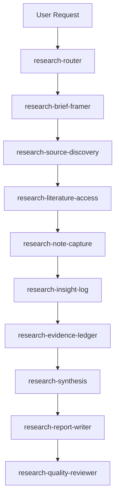

# Research 技能包指南

**PEtFiSh Research 技能包**将模糊的研究任务转化为可追踪、有证据支撑且经过质量审查的输出。该技能包并没有依赖单一的提示词来生成容易产生幻觉的摘要，而是将研究过程分解为结构化、严谨的步骤。

该技能包涵盖了 **8 个研究领域**的 **54 个专用 skills**，它强制执行一个简单的规则：*证据优先。每一个主张（claim）都必须追溯到来源。*

---

## 快速开始：安装

使用 PEtFiSh 远程安装器全局安装 research 技能包：

=== "Windows PowerShell"

    ```powershell
    & ([scriptblock]::Create((irm https://raw.githubusercontent.com/kylecui/petfish.ai/master/remote-install.ps1))) -Pack research
    ```

=== "macOS / Linux / WSL"

    ```bash
    curl -fsSL https://raw.githubusercontent.com/kylecui/petfish.ai/master/remote-install.sh | bash -s -- --pack research
    ```

---

## 快速开始：5 步完成研究

现在就想研究一个话题？以下是使用该技能包的最快方法：

1. **触发路由器 (Router)**：告诉你的 AI，`"研究 [你的话题]"` 或 `"帮我调查 [某个问题]"`。
2. **审查简报 (Brief)**：Agent 会使用 `research-brief-framer` 定义核心问题、范围和边界。
3. **收集证据 (Evidence)**：Agent 会寻找资料来源 (`research-source-discovery`) 并记录笔记 (`research-note-capture`)。
4. **综合分析 (Synthesize)**：笔记会被提升为 Evidence Ledger（证据账本），然后被综合为结构化的研究发现 (`research-synthesis`)。
5. **生成与审查**：Agent 会撰写最终报告 (`research-report-writer`)，并在向你展示最终结果之前运行一次独立的审计 (`research-quality-reviewer`)。

---

## 核心研究链路

技能包的核心是**核心研究链路 (Core Research Chain)**，这是一系列旨在通过分离数据收集、综合、生成和审查来防止 AI 幻觉的 skills。



!!! tip "职责分离"
    生成和审查是严格分离的。`research-quality-reviewer` 总是会在报告起草*之后*运行，以捕捉无证据支持的主张、逻辑漏洞或 AI 腔调（AI slop）。

### 分步演示

让我们看看一个真实的研究任务是如何在这个链路中流转的。假设你问：*"研究一下 WebAssembly 目前在后端开发中的现状。"*

#### 1. Router & Brief Framer
系统首先对你的请求进行分类，并定义研究的边界。

=== "Prompt"
    ```text
    研究 WebAssembly (Wasm) 目前在后端开发中的现状。它准备好用于生产环境了吗？
    ```

=== "Output: 00_brief/wasm_backend_brief.md"
    ```markdown
    # Research Brief: WebAssembly in Backend
    
    **Core Question:** Is WebAssembly mature enough for backend production workloads?
    **Scope Boundaries:** Focus on server-side runtimes (Wasmtime, WasmEdge), language support, and containerization. Exclude browser-based Wasm.
    **Evidence Requirements:** Look for production case studies, benchmark data, and CNCF landscape reports.
    ```

#### 2. 资料发现与获取
Agent 寻找高质量、可验证的来源。

=== "Prompt"
    ```text
    根据 Wasm 后端简报寻找相关资料。
    ```

=== "Output: 01_sources/sources.jsonl"
    ```jsonl
    {"source_id": "src_001", "url": "https://cncf.io/reports/wasm-2025", "authority": "High", "status": "accessed"}
    {"source_id": "src_002", "url": "https://github.com/bytecodealliance/wasmtime", "authority": "High", "status": "accessed"}
    {"source_id": "src_003", "url": "https://blog.example.com/wasm-hype", "authority": "Low", "status": "rejected"}
    ```

#### 3. 笔记捕获与洞察
Agent 阅读来源并提取准确的引语和发现。

=== "Prompt"
    ```text
    阅读已获取的来源并记录笔记。
    ```

=== "Output: 02_notes/notes.jsonl"
    ```jsonl
    {"note_id": "note_001", "source_id": "src_001", "quote": "Wasmtime execution speed has improved 40% year over year.", "type": "EXTRACTED"}
    {"note_id": "note_002", "source_id": "src_002", "quote": "Component Model is still in draft phase.", "type": "EXTRACTED"}
    ```

#### 4. Evidence Ledger 与综合分析
笔记被提升为 evidence ledger（证据账本），然后综合成关键发现。

=== "Prompt"
    ```text
    将笔记综合成结构化的矩阵。
    ```

=== "Output: 05_analysis/synthesis_matrix.md"
    ```markdown
    ## Synthesis Matrix
    
    | Finding | Confidence | Supporting Evidence | Contradictions |
    |---------|------------|---------------------|----------------|
    | Execution speed is production-ready | High | `ev_001`, `ev_004` | None |
    | Component Model tooling is mature | Low | None | `ev_002` states it is in draft |
    ```

#### 5. 报告撰写与质量审查
Agent *仅仅*基于综合分析的结果起草报告，然后由一个独立的审查员来检查其中的主张（claims）。

=== "Prompt"
    ```text
    起草最终报告并运行一次质量审查。
    ```

=== "Output: 07_reviews/qa_report.md"
    ```markdown
    # Quality Review: FAIL
    
    **Issue:** The report claims "Wasm is replacing Docker everywhere."
    **Reason:** No evidence in the ledger supports this. Sources `ev_001` and `ev_003` indicate they are complementary.
    **Action:** Rewrite section 3 to reflect the complementary relationship.
    ```

---

## 8 个研究领域

该技能包会根据你的特定需求将请求路由到八个专门的领域之一。每个领域都引入了特定的术语和框架。

### 1. 科学研究 (Scientific Research)
用于学术文献、方法论设计和论文写作。该领域为 AI 生成带来了学术的严谨性。

??? abstract "Scientific Skills Breakdown"
    - `scientific-literature-review`: Conducts systematic reviews, filters inclusion criteria, and builds related work matrices.
    - `scientific-gap-finder`: Differentiates between true research gaps and pseudo-gaps based on verifiable literature.
    - `scientific-methodology-designer`: Translates ideas into falsifiable research designs with clear validity threats.
    - `scientific-experiment-planner`: Maps baselines, ablations, and statistical tests.
    - `scientific-paper-writer`: Generates paper skeletons and contribution framing.
    - `scientific-review-rebuttal`: Performs pre-submission self-reviews across 6 dimensions (novelty, soundness, etc.).

=== "Prompt"
    ```text
    就 LLM 上下文扩展（context scaling）的最新进展进行系统的文献综述。找出 research gaps 并起草一份实验计划。
    ```
=== "What Happens"
    Agent 搜索 arXiv，从前 20 篇论文中提取方法论，构建 related work 矩阵，并输出一个针对所识别 gap 的可证伪的实验设计。
=== "Prompt 2"
    ```text
    对照 NeurIPS 的 checklist 审阅这篇论文草稿。
    ```
=== "What Happens"
    `scientific-review-rebuttal` skill 审计草稿，检查可重复性、合理性和伦理披露，生成逐条的审稿人反馈。

??? example "示例: Gap Finder 输出"
    ```markdown
    ## Research Gaps Identified
    
    **Gap 1: Long-context Retrieval Degradation (True Gap)**
    - **Current State:** Most models degrade past 32k tokens when needles are placed in the middle of the context (Source: `src_arxiv_2311_1234`).
    - **Proposed Contribution:** A dynamic attention allocation mechanism that weights middle-context blocks higher during retrieval tasks.
    - **Verifiability:** High. Can be benchmarked using the Needle-in-a-Haystack protocol.
    ```

??? example "示例: Experiment Plan 输出"
    ```markdown
    ## Experiment Plan: Dynamic Attention for Long-Context Retrieval

    **Hypothesis:** Dynamically re-weighting attention scores for middle-context positions
    will improve Needle-in-a-Haystack recall by ≥15% at 128k tokens without
    degrading perplexity on standard benchmarks.

    **Variables:**
    - Independent: Attention re-weighting strategy (uniform, linear-decay, learned)
    - Dependent: Retrieval recall@1, perplexity on WikiText-103
    - Controlled: Model size (7B), tokenizer, hardware (8×A100)

    **Baselines:**
    - Vanilla Transformer (no re-weighting)
    - ALiBi positional encoding
    - YaRN context extension

    **Ablations:**
    1. Re-weighting without fine-tuning (zero-shot transfer)
    2. Re-weighting with LoRA fine-tuning on 10k examples
    3. Position-aware vs position-agnostic re-weighting

    **Statistical Tests:** Paired t-test across 5 seeds; report mean ± std.
    **Reproducibility:** All configs in `configs/`, seeds fixed, Docker image provided.
    ```

!!! tip "使用明确的方法论名称"
    与其说“研究这个”，不如说“执行系统文献综述”或“进行消融实验 (ablation study)”。这些 skills 是根据学术术语进行调优的。

!!! warning "常见错误：跳过 Literature Matrix"
    不要直接跳到寻找 gap。`scientific-literature-review` 会构建现有方法、数据集和结果的结构化矩阵。没有它，gap finder 就没有比较的基础，并且会产生文献中已经有解决方案的表面化“gaps”。

### 2. 产品研究 (Product Research)
用于用户研究、竞品分析和市场验证。旨在让产品经理关注用户价值而不是功能的堆砌。

??? abstract "Product Skills Breakdown"
    - `product-user-research`: Designs user interviews, surveys, and usability tests to ground decisions in actual user feedback.
    - `product-competitor-analysis`: Executes systematic competitor discovery, SWOT analysis, and feature matrices.
    - `product-opportunity-mapper`: Evaluates problem spaces using Jobs-to-be-Done (JTBD) and underserved needs scoring.
    - `product-validation-planner`: Designs MVPs and go/kill decision trees.
    - `product-decision-brief`: Synthesizes research into a final go/no-go/pivot document for stakeholders.

=== "Prompt"
    ```text
    对现代 CI/CD 工具进行竞品分析，并根据 Reddit 和 GitHub 上的用户抱怨生成一个机会映射 (opportunity map)。
    ```
=== "What Happens"
    Agent 构建一个比较 GitHub Actions、GitLab CI 和 CircleCI 的 feature matrix，抓取用户抱怨，并将它们映射到服务不足的 Jobs-to-be-Done 上。
=== "Prompt 2"
    ```text
    为我们新的内部开发者门户设计一份用户访谈指南。
    ```
=== "What Happens"
    `product-user-research` skill 生成一份筛选问卷和一份结构化的访谈脚本，避免引导性问题。

??? example "示例: Opportunity Map 输出"
    ```markdown
    ## JTBD Opportunity Score
    
    | Job to be Done | Importance (1-10) | Current Satisfaction (1-10) | Opportunity Score |
    |----------------|-------------------|-----------------------------|-------------------|
    | Debug failing CI pipelines locally | 9 | 3 | **15.0** (High) |
    | Manage cross-repo dependencies | 8 | 5 | **11.0** (Medium) |
    | View build execution logs | 7 | 8 | **6.0** (Low/Overserved) |
    ```

!!! tip "避免引导 Agent"
    不要说“证明我们的功能比竞争对手 X 更好”。让 Agent “构建一个客观的 feature matrix”。

??? example "示例: User Interview Guide 输出"
    ```markdown
    ## Interview Guide: Internal Developer Portal

    **Screener Questions:**
    1. Do you use internal tooling daily? (Must be Yes)
    2. Role: Frontend / Backend / DevOps / Other
    3. Tenure: <6 months / 6-24 months / 2+ years

    **Core Questions (30 min):**
    1. Walk me through your last deployment. What tools did you touch?
       - Follow-up: Where did you get stuck?
    2. When you need to find internal documentation, what do you do first?
       - Follow-up: How often does that work?
    3. If you could change ONE thing about your dev workflow, what would it be?
       - Follow-up: What would that save you?

    **Closing:**
    - Is there anything I didn't ask about that you think matters?
    - Would you be willing to test a prototype in 2 weeks?

    **Anti-bias Notes:**
    - Do NOT mention the portal concept until after core questions.
    - Do NOT ask "Would you like a portal?" — this is a leading question.
    ```

!!! warning "常见错误：用户研究中的确认偏误"
    最危险的产品研究错误是设计出证实你已有信念的研究。`product-user-research` skill 明确防范引导性问题，但你也必须避免挑选对你有利的用户群体进行访谈。始终至少包含一个可能*不同意*你的假设的细分群体。

### 3. 规划研究 (Planning Research)
用于战略路线图、环境扫描和利益相关方对齐。是季度规划和宏观经济分析的理想选择。

??? abstract "Planning Skills Breakdown"
    - `planning-environment-scanner`: Executes PESTLE analysis, trend radar, and weak signal identification.
    - `planning-stakeholder-analyst`: Maps influence/interest grids and engagement strategies.
    - `planning-scenario-planner`: Develops alternative futures and robust strategies under critical uncertainties.
    - `planning-policy-researcher`: Analyzes regulatory landscapes and compliance trends.
    - `planning-technology-assessor`: Assesses Technology Readiness Levels (TRL) and adoption feasibility.
    - `planning-roadmap-developer`: Synthesizes inputs into a phased strategic roadmap with dependencies and decision gates.

=== "Prompt"
    ```text
    对欧洲电动汽车市场进行 PESTLE 分析，并帮我起草一份 3 年期战略路线图。
    ```
=== "What Happens"
    Agent 扫描宏观经济趋势，评估监管环境，并构建带有明确 go/no-go 里程碑的分阶段路线图。
=== "Prompt 2"
    ```text
    为我们即将进行的云迁移绘制利益相关方地图。
    ```
=== "What Happens"
    `planning-stakeholder-analyst` skill 生成一个影响力/兴趣网格，识别关键赞助者、阻碍者以及针对每个群体的参与策略。

??? example "示例: PESTLE Scan 输出"
    ```markdown
    ## PESTLE Analysis: EU EV Market
    
    **Political / Regulatory (High Impact)**
    - **Signal:** Euro 7 emission standards implementation (`ev_012`).
    - **Risk:** Increased compliance costs for legacy fleets.
    - **Strategic Action:** Accelerate transition of mid-tier models to full BEV by 2026.
    ```

!!! tip "拥抱不确定性"
    使用 `planning-scenario-planner` 询问替代未来。不要假设只有单一结果；要求那些能在多个情景下存活的稳健策略。

??? example "示例: Scenario Matrix 输出"
    ```markdown
    ## Scenario Matrix: Cloud Infrastructure Strategy

    **Critical Uncertainties:**
    - X-axis: Cloud vendor pricing (Stable vs Volatile)
    - Y-axis: Regulatory environment (Permissive vs Restrictive)

    | | Stable Pricing | Volatile Pricing |
    |---|---|---|
    | **Permissive Regulation** | Scenario A: "Smooth Scaling" — Maximize single-vendor commitment | Scenario B: "Hedged Bets" — Multi-cloud with spot instance arbitrage |
    | **Restrictive Regulation** | Scenario C: "Compliance Fortress" — Invest in private cloud capability | Scenario D: "Perfect Storm" — Hybrid with sovereign cloud for regulated data |

    **Robust Strategy (survives all 4):**
    - Maintain multi-cloud abstraction layer regardless of scenario
    - Keep ≤60% workload on any single vendor
    - Build compliance tooling that works across all deployment targets
    ```

!!! warning "常见错误：单路径规划"
    如果你的路线图没有决策门或替代路径，那它就不是计划——那只是愿望。一定要在运行 `planning-roadmap-developer` 之前先运行 `planning-scenario-planner`，对你的假设进行压力测试。

### 4. 学习研究 (Learning Research)
用于构建个人或团队的学习旅程。阻止漫无目的的浏览，建立可衡量的进度。

??? abstract "Learning Skills Breakdown"
    - `learning-goal-framer`: Transforms vague aspirations ("I want to learn X") into capability-based goals.
    - `learning-prerequisite-mapper`: Audits necessary foundational knowledge to prevent drop-off.
    - `learning-resource-discovery`: Finds tutorials, documentation, and benchmarks.
    - `learning-path-designer`: Structures learning into milestones and deliverables.
    - `learning-practice-planner`: Develops hands-on drills and mini-projects to reinforce concepts.
    - `learning-progress-reviewer`: Conducts periodic reviews of conceptual and procedural transfer.

=== "Prompt"
    ```text
    我想学习用于后端 Web 开发的 Rust。制定我的学习目标并构建一个分阶段的练习计划。
    ```
=== "What Happens"
    Agent 会分解目标，映射先修知识（所有权、借用），找到官方书籍和相关的 crate (Actix, Axum)，并设置具体的编码微项目。
=== "Prompt 2"
    ```text
    审查我在模块 2（Rust 生命周期）上的进度。
    ```
=== "What Happens"
    `learning-progress-reviewer` 评估你的代码片段，识别概念上的误解，并提出针对性的练习建议。

??? example "示例: Prerequisite Map 输出"
    ```markdown
    ## Prerequisite Audit
    
    **Goal:** Build a high-throughput backend API in Rust using Axum.
    
    **Missing Prerequisites Detected:**
    - `Async/Await in Rust`: You need to understand Tokio executors before using Axum.
    - `Send + Sync traits`: Crucial for sharing state across thread pools.
    
    **Action:** Added a 3-day primer module on Rust concurrency before starting the web framework tutorials.
    ```

!!! tip "注重产出，不只是阅读"
    当使用 `learning-practice-planner` 时，让 Agent 设计“迁移任务 (transfer tasks)”——这些练习迫使你将知识应用到一个新问题上，而不是仅仅复制教程。

??? example "示例: 包含里程碑的 Learning Path"
    ```markdown
    ## Learning Path: Rust for Backend Development

    **Phase 1: Foundations (Week 1-2)**
    - Goal: Understand ownership, borrowing, and lifetimes
    - Resources: The Rust Book (Ch. 4-10), Rustlings exercises
    - Deliverable: Complete Rustlings ownership section with 0 hints
    - Checkpoint: Explain ownership transfer in your own words

    **Phase 2: Async Rust (Week 3-4)**
    - Goal: Write async code with Tokio
    - Resources: Tokio tutorial, async-std docs
    - Deliverable: Build a concurrent file downloader (5 parallel streams)
    - Checkpoint: Explain why `Send + Sync` matters for shared state

    **Phase 3: Web Framework (Week 5-6)**
    - Goal: Build a REST API with Axum
    - Resources: Axum examples repo, Tower middleware docs
    - Deliverable: CRUD API with auth middleware, tested with cargo test
    - Checkpoint: Deploy to a Linux server, handle graceful shutdown

    **Transfer Task (Week 7):**
    Port an existing Python FastAPI service to Axum. Compare latency and memory.
    ```

!!! warning "常见错误：教程地狱 (Tutorial Hell)"
    光看教程而不构建任何东西是最常见的学习失败模式。`learning-practice-planner` 有意从 概念训练 → 代码实验 → 微项目 → 迁移任务 逐级递进。不要跳过迁移任务——那才是真正发生学习的地方。

### 5. 决策研究 (Decision Research)
用于复杂的、多选项的决策制定，使权衡取舍可见且可追踪。

??? abstract "Decision Skills Breakdown"
    - `decision-brief-framer`: Structures the overarching decision problem, constraints, and decision-makers.
    - `decision-criteria-builder`: Establishes weighted comparison criteria, separating nice-to-haves from deal-breakers.
    - `option-comparison-matrix`: Scores candidates across criteria with links to supporting evidence.
    - `decision-recommendation`: Provides final verdicts with rollback paths and pilot conditions.

=== "Prompt"
    ```text
    帮我决定是否从 PostgreSQL 迁移到 DynamoDB。建立一个包含一票否决项（deal-breakers）的对比矩阵。
    ```
=== "What Happens"
    Agent 会定义决策标准（如，查询灵活性 vs. 扩展性），建立一票否决项（如，ACID 合规需求），对两个数据库进行评分，并提供有记录支持的建议。
=== "Prompt 2"
    ```text
    我们需要选择一个新的前端框架 (React, Vue, Svelte)。构建对比标准。
    ```
=== "What Happens"
    `decision-criteria-builder` 会询问你的团队规模、现有专业知识和性能需求，以在审视这些框架之前生成加权标准。

??? example "示例: Comparison Matrix 输出"
    ```markdown
    ## Option Comparison: Database Migration
    
    | Criterion | Weight | PostgreSQL | DynamoDB |
    |-----------|--------|------------|----------|
    | Horizontal Scale | 30% | 4/10 (`ev_045`) | 9/10 (`ev_046`) |
    | Relational Queries | 40% | 10/10 (`ev_047`) | 2/10 (`ev_048`) |
    | Operational Cost | 30% | 6/10 (`ev_049`) | 8/10 (`ev_050`) |
    
    **Deal-breaker Check:** DynamoDB fails the "complex JOIN support" deal-breaker established in the brief.
    **Recommendation:** Do not migrate core relational data; consider a hybrid approach.
    ```

!!! tip "首先确立标准"
    永远不要在没有先使用 `decision-criteria-builder` 的情况下让 Agent “比较 X 和 Y”。如果你不定义什么是重要的，比较结果将是泛泛的、毫无用处的。

??? example "示例: 包含回滚方案的 Decision Recommendation"
    ```markdown
    ## Decision Recommendation: Database Migration

    **Verdict:** Do NOT migrate core relational data to DynamoDB.
    **Confidence:** High (based on 8 evidence items across 4 sources).

    **Recommended Path:** Hybrid approach
    1. Keep PostgreSQL for transactional/relational workloads
    2. Introduce DynamoDB for session storage and event logs only
    3. Use a data access abstraction layer to allow future migration

    **Pilot Conditions:**
    - Run DynamoDB for session storage in staging for 30 days
    - Success metric: p99 latency ≤ 5ms, zero data loss
    - Kill criterion: Any ACID violation in audit logs

    **Rollback Path:**
    - Session storage can fall back to Redis (existing infrastructure)
    - No schema changes required in PostgreSQL
    - Estimated rollback time: 2 hours
    ```

!!! warning "常见错误：没有标准就进行比较"
    最危险的决策制定失败就是不首先定义“对谁更好，在什么约束下？”就直接跳到“哪个更好？”。始终按顺序运行 `decision-criteria-builder` → `option-comparison-matrix` → `decision-recommendation`。

### 6. 风险采购研究 (Risk-Procurement Research)
用于企业环境中的供应商尽职调查、安全审计和采用可行性分析。

??? abstract "Risk-Procurement Skills Breakdown"
    - `risk-research-brief`: Defines the boundary and constraints of the risk assessment.
    - `vendor-source-diligence`: Checks open-source bus factors, SLA commitments, and lock-in risks.
    - `security-risk-review`: Audits data residency, access controls, and prompt injection vectors.
    - `compliance-check`: Maps license constraints and cross-border data transfer risks.
    - `tco-operational-risk`: Evaluates direct costs, hidden operational costs, and buy vs. build matrices.
    - `adoption-recommendation`: Forms the final adopt/control/pilot/defer/reject verdict.

=== "Prompt"
    ```text
    对在我们生产环境中采用这个新的开源库进行安全和 TCO 风险审查。
    ```
=== "What Happens"
    Agent 会检查 GitHub 仓库的维护活跃度，审计许可证，评估依赖树中已知的 CVE，并估算在内部维护它的运营成本。
=== "Prompt 2"
    ```text
    对公司 X 进行一次供应商尽职调查。
    ```
=== "What Happens"
    `vendor-source-diligence` skill 会查找 SLA 历史、数据驻留政策和退出条件，以防止供应商锁定。

??? example "示例: Adoption Recommendation 输出"
    ```markdown
    ## Adoption Recommendation: OpenSourceLib v2
    
    **Verdict:** `PILOT`
    
    **Evidence Sufficiency:** High. 14 sources analyzed, including issue trackers and license files.
    
    **Risk Mitigations Required Before Pilot:**
    1. Fork the repository internally due to low Bus Factor (only 1 active maintainer).
    2. Implement a wrapper interface to mitigate API instability observed in recent minor versions (`ev_sec_004`).
    ```

!!! tip "寻找隐藏成本"
    在使用 `tco-operational-risk` 时，专门要求 Agent 评估“退出成本”和“锁定风险”。今天最便宜的工具明天可能是离开成本最高的。

??? example "示例: TCO Analysis 输出"
    ```markdown
    ## TCO Analysis: OpenSourceLib v2 (3-Year Horizon)

    | Cost Category | Year 1 | Year 2 | Year 3 | Notes |
    |---------------|--------|--------|--------|-------|
    | License | $0 | $0 | $0 | Apache-2.0 |
    | Integration | $15k | $2k | $2k | Initial wrapper + annual maintenance |
    | Internal fork maintenance | $0 | $8k | $12k | Bus factor = 1; expect to self-maintain |
    | Training | $3k | $1k | $0 | Team ramp-up |
    | **Total** | **$18k** | **$11k** | **$14k** | |

    **Hidden Cost Alert:**
    - If the sole maintainer abandons the project (probability: 35% based on commit frequency),
      Year 2-3 maintenance costs could triple to $24k/year.
    - Exit cost to migrate to Alternative B: estimated $45k (3 months of engineering).

    **Scenario Sensitivity:**
    - Best case (maintainer stays active): 3-year TCO = $35k
    - Worst case (maintainer leaves Y1): 3-year TCO = $87k
    - Break-even vs Commercial Alternative A: Year 2.5
    ```

!!! warning "常见错误：忽略退出成本"
    每一次采用决策都应包含退出计划。让 Agent 显式为每个选项建立“退出成本 (walk-away cost)”模型。一个具有 10 万美元迁移成本的免费工具并非真正的免费。

### 7. 体验活动研究 (Experience-Event Research)
用于规划活动、旅行和参与者旅程，做到零后勤盲区。

??? abstract "Experience-Event Skills Breakdown"
    - `experience-brief-framer`: Defines the goal, constraints, and success criteria of the event.
    - `venue-destination-research`: Evaluates venues based on capacity, accessibility, and permit requirements.
    - `schedule-itinerary-planner`: Balances event density with buffer times and fallback options.
    - `participant-experience-designer`: Maps attendee journeys and optimizes touchpoints.
    - `logistics-risk-planner`: Uncovers controllable vs uncontrollable logistical risks.
    - `event-runbook-writer`: Generates executable timelines (run-of-show) and emergency SOPs.

=== "Prompt"
    ```text
    在柏林规划一个为期 3 天的技术工作坊。研究场地并生成一份后勤风险计划。
    ```
=== "What Happens"
    Agent 会确定活动范围，比较场地（基于音视频能力和交通便利性），规划带有充足缓冲时间的日常日程，并针对航班延误或设备故障起草一份风险计划。
=== "Prompt 2"
    ```text
    为我们年度峰会设计参会者旅程 (attendee journey)。
    ```
=== "What Happens"
    `participant-experience-designer` 绘制从注册到会后跟进的整个体验过程，识别摩擦点（如长时间排队换取胸牌），并提出缓解措施。

??? example "示例: Event Runbook 输出"
    ```markdown
    ## Run of Show: Day 1 Morning
    
    | Time | Action | Owner | Notes / Contingency |
    |------|--------|-------|---------------------|
    | 08:00 | Registration open | Team A | Backup iPads ready at desk 3 |
    | 08:45 | AV Check (Keynote) | Team B | Test clicker and audio levels |
    | 09:00 | Keynote Starts | Speaker | If speaker is delayed, play intro video loop |
    ```

!!! tip "总是询问应急预案"
    一个好的活动计划会预见失败。让 `logistics-risk-planner` 为前 3 大高影响风险生成 "Plan B" 情景。

### 8. 领域适配器 (Domain Adapters)
轻量级覆盖层，将特定领域的检查清单注入主研究链，而不会重复核心逻辑。

??? abstract "Adapters Breakdown"
    - `travel-adapter`: Checks visa limits, weather, local transport, and health insurance.
    - `conference-adapter`: Adds CFP deadlines, speaker management, and AV recordings.
    - `training-event-adapter`: Adds lab environments, certification tracking, and instructor materials.
    - `content-selection-adapter`: Adds audience preferences, ratings, and availability checks.

=== "Prompt"
    ```text
    帮我在伦敦组织一场技术会议。
    ```
=== "What Happens"
    Router 检测到活动意图，并自动触发 `conference-adapter` 与核心活动规划工作流一起运行，注入 CFP 截止日期和演讲者管理的检查。
=== "Prompt 2"
    ```text
    规划一个去日本的 2 周假期。
    ```
=== "What Happens"
    `travel-adapter` 启动，确保研究包括签证要求、季节天气影响和 JR Pass 后勤，而这些在通用的活动计划中是不会出现的。

??? example "示例: Adapter Injection 输出"
    ```markdown
    ## Logistical Brief (Enhanced with Travel Adapter)
    
    **Standard Event Checks:**
    - Venue capacity
    - Budget limits
    
    **Injected Travel Checks:**
    - Visa requirements for all participants (US, UK, EU citizens)
    - Medical insurance coverage limits
    - Local currency exchange availability
    ```

!!! tip "将适配器与核心链路结合使用"
    你不需要手动调用适配器。如果你清楚地说明了你的目标（“我正在规划一个培训工作坊”），路由器就会无缝地将 `training-event-adapter` 编织进该过程中。

---

## 数据格式约定

该技能包使用严格的格式边界来确保数据在脚本和人类之间可靠地流动。

- **JSONL（面向机器）：** 像 `source-discovery`、`note-capture` 和 `evidence-ledger` 这类数据密集型 skills 默认输出 JSON Lines (`.jsonl`)。
  - *为什么？* JSONL 允许逐行进行程序化验证、轻松使用 grep/sed 提取，并能实现稳健的管线拼接，同时避免在超大上下文窗口中遭遇庞大的 JSON 解析错误。
- **Markdown（面向人类）：** 像 `brief-framer`、`synthesis` 和 `report-writer` 等叙事性输出，默认使用 Markdown (`.md`)。
  - *为什么？* 这种格式非常适合人类阅读审查、协作编辑和易读的演示。

这是有意为之的设计选择：JSONL 完美保留了可追踪的证据链，而 Markdown 清晰地将最终的洞见展现给人类读者。这两种格式在各自的领域都是正确的。

### 研究工作区结构

当你启动一项研究任务时，Agent 将建立一个标准化的目录结构，以保持格式分离并保证流水线的干净整洁。

```text
research/
  ├── CONTEXT.md          # Active state, current progress, and active topic
  ├── 00_brief/           # Markdown: Research briefs, scoping, and criteria
  ├── 01_sources/         # JSONL: Source index, access logs, and URLs
  ├── 02_notes/           # JSONL: Raw reading notes, extracts, and quotes
  ├── 03_evidence/        # JSONL: The formal evidence ledger mapping claims to sources
  ├── 04_methods/         # Markdown: Methodology designs, experiment plans
  ├── 05_analysis/        # Markdown: Synthesis matrices, opportunity maps, SWOTs
  ├── 06_outputs/         # Markdown: Final reports, briefs, and recommendations
  ├── 07_reviews/         # Markdown: Quality reviewer reports, citation audits
  └── adr/                # Markdown: Architecture Decision Records for the research
```

---

## 证据类型

为了防止 AI 产生幻觉，`research-evidence-ledger` 会在将任何信息输入最终报告之前，对每条信息进行严格的分类。这迫使 Agent 区分它读到的东西、推断出的东西以及它想象出来的东西。

| Type | 含义 | 报告处理方式 | 示例 |
|---|---|---|---|
| `EXTRACTED` | 明确从已验证的来源中获得的直接引用或事实。 | 包含引用并进入报告。 | *"React 19 introduces the useActionState hook."* (`src_001`) |
| `INFERRED` | 通过结合多个验证过的事实，合乎逻辑地推导出来。 | 显式标注带有推理的结论。 | *"Because React 19 adds useActionState (`src_001`), third-party form libraries may see reduced adoption."* |
| `AMBIGUOUS` | 在不同的经验证来源中发现冲突的信息。 | 作为不确定性透明展示。 | *Source A claims 40% performance gain, Source B claims 15%.* |
| `PROPOSED` | AI 提出的假设、建议或创造性的跳跃。 | 标注为推荐意见，绝非事实。 | *"We should migrate our legacy forms to useActionState to reduce bundle size."* |

!!! warning "严格的经验法则"
    如果一个主张 (claim) 缺少有效的 `source_id` 和 `evidence_id`，`research-quality-reviewer` 会将其标记为不受支持的主张，并拒绝通过该报告。

---

## 技巧与最佳实践

1. **总是从模糊开始，让 Router 去细化。**
   你不需要指定使用哪些 skills，也不用记住这 54 个名称。只需清晰表达你的意图 (`"研究一下 X 的可行性"`)，让 `research-router` 处理编排工作。

2. **保持工作区整洁。**
   该技能包期望有标准的目录结构 (`00_brief/`、`01_sources/`、`02_notes/` 等)。让 Agent 自动创建这些文件夹，这样流水线才能正常运转。不要在错误的目录中手动混入 JSONL 和 Markdown 文件。

3. **审计你的引用。**
   如果你怀疑 Agent 意译得过于宽泛，使用 `research-citation-auditor`。它会执行从 claim → evidence_id → source_id 的严格回溯。

4. **安全地捕获想法。**
   研究期间突然有了想法？让 Agent 使用 `research-insight-log` 将其记录下来。这可以安全地将想法作为一个未经测试的假设停放，而不会错误地将其作为“事实”注入你的 evidence ledger (证据账本)中。

5. **强制执行守门人。**
   不要跳过 `research-quality-reviewer`。它经过专门训练，可以检测 "AI slop"（如 "it's important to note", "delve" 等常见 AI 废话套话），如果基调偏向标准的 LLM 废话，它会强迫作者重写报告。

6. **在比较之前要求给出具体的标准。**
   ??? info "标准优先法则 (Criteria-First Rule)"
       永远不要在没有生成标准矩阵的情况下，让 AI 去比较选项（工具、供应商、架构）。使用 `decision-criteria-builder` 在 AI 开始评分之前，定义什么是重要的（例如，成本、规模、合规性）。

7. **使用适配器 (adapters) 注入检查清单。**
   如果你的任务属于某个特定领域（比如规划旅行或会议），明确说明活动类型，以便 router 可以附加适配器（例如，`travel-adapter`）。这确保了特定领域的边缘情况能够得到自动检查。

8. **谨慎对待 INFERRED 和 PROPOSED 证据。**
   在审查最终报告时，密切关注标记为 `INFERRED` 或 `PROPOSED` 的主张。这些代表的是 AI 的推理，而非铁一般的事实。一定要验证这些主张背后的逻辑。

9. **不要对简报 (brief) 操之过急。**
   ??? info "简报是基础"
       糟糕的简报会导致糟糕的研究输出。花点时间审查 `research-brief-framer` 输出的内容。如果范围太宽泛或者核心问题错了，在 Agent 开始拉取来源之前纠正它。

10. **使用 JSONL 文件进行管线集成。**
    如果你要构建自己的脚本或 CI/CD 检查，请直接解析 `03_evidence/` 下的 JSONL 文件。它们提供结构化、机器可读的真相，通过编程验证要比从 Markdown 报告中提取验证容易得多。

---

## 组合研究领域

现实世界中的问题很少能简单地归入单个领域。研究包的设计注重组合性——你可以在单个研究项目中串联来自不同领域的 skills。

### 示例：“我们应该自建还是购买？”

这个问题跨越了**产品研究**、**风险采购**和**决策制定**：

```text
1. product-user-research       → Understand what users actually need
2. product-competitor-analysis  → Map existing solutions in the market
3. risk-research-brief          → Define what "risk" means for this decision
4. vendor-source-diligence      → Evaluate the top 3 vendor candidates
5. tco-operational-risk         → Model 3-year cost for build vs buy vs hybrid
6. decision-criteria-builder    → Define weighted scoring criteria
7. option-comparison-matrix     → Score all options against criteria
8. decision-recommendation      → Generate final go/no-go with rollback plan
```

??? example "跨领域 Prompt"
    ```text
    We're deciding whether to build an internal auth service or adopt Auth0/Clerk.
    Research user needs, evaluate vendors, model TCO for 3 years, and give me a
    final recommendation with exit costs.
    ```

    Router 将检测到多领域意图，并自动编排产品、风险采购和决策等领域的 skills。

### 示例：“策划一场以研究为重心的会议”

这结合了**科学研究**和**体验活动规划**：

```text
1. scientific-literature-review → Survey the field to define session topics
2. scientific-gap-finder        → Identify hot gaps to attract submissions
3. experience-brief-framer      → Define the conference goals and audience
4. venue-destination-research   → Evaluate venue options
5. conference-adapter           → Add CFP deadlines, speaker management, AV
6. schedule-itinerary-planner   → Build the 3-day agenda
7. event-runbook-writer         → Generate the run-of-show document
```

### 示例：“启动一个新的学习项目”

这结合了**学习研究**和**课程开发**：

```text
1. learning-goal-framer           → Define target competencies
2. learning-prerequisite-mapper   → Map knowledge dependencies
3. learning-resource-discovery    → Find best existing materials
4. learning-path-designer         → Design the staged curriculum
5. learning-practice-planner      → Create hands-on exercises
6. course-outline-design          → Structure into deliverable modules
7. course-content-authoring       → Write the actual lessons
```

!!! tip "让 Router 帮你组合"
    你不需要手动指定这个流程链路。只需清楚地描述你的目标，`research-router` 就会检测到多领域性质，并组装出合适的管道。上面的示例展示的是后台发生的事情。

### 组合规则

1. **简报 (brief) 永远是第一位。** 每个跨领域项目都以确定范围的 skill（`research-brief-framer`、`risk-research-brief`、`experience-brief-framer`、`learning-goal-framer` 或 `decision-brief-framer`）开始。
2. **证据向前流转。** 在早期阶段收集的来源和笔记，可通过共享的工作区目录自动用于后续的 skills。
3. **审查总是在最后。** 无论涉及多少个领域，`research-quality-reviewer` 或 `research-citation-auditor` 总是在最后运行以捕捉无根据的主张。
4. **适配器附加于其上。** 领域适配器 (`travel-adapter`、`conference-adapter` 等) 注入额外的检查清单，而不破坏核心的研究链。

---

## 常见错误

以下是基于实际使用模式中总结的，使用 research 技能包时最容易陷入的误区。

### 1. 跳过简报 (Brief)

!!! failure "导致研究结果不佳的第一大原因"
    没有先运行 `research-brief-framer`，就直接跳到 `research-source-discovery`，会产生不聚焦、杂乱无章的研究，且回答了错误的问题。

    **修复方案:** 永远先让 router 生成一份简报。审查它。如果需要则缩小范围，然后再继续。

### 2. 将 AI 推理当成事实

!!! failure "幻觉洗白 (Hallucination Laundering)"
    Agent 将一个 claim 标记为 `INFERRED`，意味着这是它从多个来源推导出的结果。你将它复制粘贴进你的报告中，却没有带上 `INFERRED` 标签。现在，这看起来就像是一条已验证的事实。

    **修复方案:** 引用研究输出时，务必保留证据类型的标签。如果一个 claim 是 `INFERRED`，请明示。如果是 `PROPOSED`，请将其视为待检验的假设，而不是定论。

### 3. 无视质量审查员 (Quality Reviewer)

!!! failure "跳过守门人"
    你用 `research-report-writer` 生成了一份报告并立刻发布。结果该报告包含 3 处没有证据支撑的断言、2 个过时的参考来源，甚至有一段以 "It's important to note that..." 这种典型 AI 句式开头的文字。

    **修复方案:** 每次生成报告后，务必运行 `research-quality-reviewer`。它能揪出无证据的主张、过时引用、典型的 AI 句式和逻辑漏洞。这短短的 2 分钟步骤能够挽救数小时的信任危机。

### 4. 错用格式

!!! warning "Markdown 跑到 JSONL 的地盘 (反之亦然)"
    把证据记录写成毫无格式的 Markdown，使得通过编程手段去验证变得完全不可能。反之，用 JSONL 格式写最终的报告，会让相关干系人根本没法阅读。

    **修复方案:** 遵循格式规范: JSONL 用于 `01_sources/`、`02_notes/`、`03_evidence/`（给机器消费的管道数据）。Markdown 用于 `00_brief/`、`04_methods/`、`05_analysis/`、`06_outputs/`、`07_reviews/`（适合人类阅读的叙事输出）。

### 5. 学习研究中的范围蔓延

!!! warning "妄想煮沸大海 (Boiling the Ocean)"
    你让 AI “帮我学习 Kubernetes”，却没有任何限制。于是 Agent 给你生成了一个长达 6 个月的学习计划，囊括了网络、存储、安全、GitOps、服务网格和多集群联邦。

    **修复方案:** 使用 `learning-goal-framer` 设置明确的边界：目标能力、时间预算和应用场景。“我想在 2 周内将一个包含 3 个微服务的应用部署到 k8s” 要比空泛的“学习 Kubernetes”有可操作性得多。

### 6. 在没有标准的情况下比较选项

!!! warning "凭直觉比较 (Gut-Feel Comparison)"
    你让 Agent 比较 4 种数据库选项。它生成了一张看起来极其严谨的表格，但里面的权重和打分完全是它临时瞎编的。

    **修复方案:** 务必在 `option-comparison-matrix` 之前运行 `decision-criteria-builder`。在进行任何打分之前，首先定义到底什么最重要（延迟、成本、团队熟练度、合规性），并分配权重。

### 7. 对长篇报告不进行引用审计

!!! warning "引用漂移 (Citation Drift)"
    在一份长达 20 页的研究报告中，Agent 将 `src_003` 这个文献引用了 12 次，然而该文献原文只能支持其中 3 处的主张。其余 9 处要么是宽泛的意译，要么是过度发挥。

    **修复方案:** 任何超过 5 页的报告，都请运行 `research-citation-auditor`。它会执行严格的 claim → evidence_id → source_id 的反溯，并将任何没有根据支撑或过度解读的引用全部标记出来。

---

## 故障排查

### "Router 老是挑错领域"

`research-router` 基于关键词和语义信号来对意图进行分类。如果它路由错了：

1. **表达得更具体些。** 不要说“研究 X”，而应说“针对 X 进行一次科学文献综述”或“评估把 X 作为我们团队供应商的情况”。
2. **明确指定领域。** 你可以直接指出 skill 的名称：“使用 `product-competitor-analysis` 去比较 X、Y 和 Z”。

### "跑完管线后，证据账本 (evidence ledger) 却是空的"

这通常意味着 `research-note-capture` 被跳过了或者没有产生任何输出：

1. 检查 `01_sources/` 是否包含至少一个 source 记录。
2. 检查 `research-literature-access` 是否成功取回了全文（查看访问尝试的日志）。
3. 如果来源藏在付费墙 (paywalls) 后，Agent 会记录下失败的访问尝试。你可能需要提供授权访问手段或替代的来源。

### "Quality Reviewer 拒绝了我的报告"

这是系统正常的拦截行为。常见的拒绝理由如下：

| 拒绝理由 | 如何处理 |
|---|---|
| 发现无证据支撑的主张 | 补充来源引用，或将该主张降级为 `PROPOSED` |
| 参考来源过时（>2年） | 寻找更新的来源，或明确在报告里解释为什么老数据依旧有效 |
| 检测到典型的 AI 套话 | 重写被标记的段落，剔除无意义的废话 |
| 缺失反面证据 | 运用 `research-synthesis` 去找出对立的观点 |
| 内容偏离了初始 Brief 的范围 | 修正报告，使其维持在原定的 brief 边界之内 |

### "我需要在研究中途重新开始"

工作区结构（从 `00_brief/` 一直到 `07_reviews/`）会完整保留当前状态：

1. 你的简报、来源和笔记都作为文件保存了下来。
2. 你可以告诉 Agent 来恢复进度：“继续处理 `research/` 目录里的研究。从我们中断的地方开始”。
3. Agent 会读取 `CONTEXT.md` 和现有的工作区来推断当前的进展阶段。

### "我该怎么在 CI/CD 中结合使用它？"

`03_evidence/` 目录下的 JSONL 文件正是为了程序化消费而设计的：

```python
import json

with open("research/03_evidence/ledger.jsonl") as f:
    for line in f:
        entry = json.loads(line)
        if entry["type"] == "PROPOSED" and entry.get("confidence", 1.0) < 0.6:
            print(f"Low-confidence proposal: {entry['claim']}")
```

你可以编写验证脚本，在报告被正式发布之前，自动拦截置信度过低的主张、缺失的引用，或分析各类证据的分布情况。

---

## 快速参考手册

### 领域 → 入口 Skill 映射

| 领域 | 从这里开始 | 何时使用 |
|---|---|---|
| Scientific (科学研究) | `scientific-literature-review` | 学术论文、系统文献综述、Gap 分析 |
| Product (产品研究) | `product-user-research` | 用户需求、市场分析、功能优先级评估 |
| Planning (规划研究) | `planning-environment-scanner` | 战略制定、利益相关方地图、情景规划 |
| Learning (学习研究) | `learning-goal-framer` | 自学计划、课程体系设计、能力评估 |
| Decision (决策研究) | `decision-brief-framer` | 方案比对、Go/No-go 决策、加权打分 |
| Risk-Procurement (风险采购) | `risk-research-brief` | 供应商评估、安全审计、TCO 分析 |
| Experience-Event (体验活动) | `experience-brief-framer` | 活动规划、行程安排、参会者旅程设计 |

### 核心链路 Skills 一览

| Skill | 角色职责 | 格式 |
|---|---|---|
| `research-router` | 意图分类与任务编排 | — |
| `research-brief-framer` | 框定研究范围 | Markdown |
| `research-source-discovery` | 发现并登记来源 | JSONL |
| `research-literature-access` | 合法地拉取全文内容 | JSONL (日志) |
| `research-note-capture` | 提取名言并作读书笔记 | JSONL |
| `research-insight-log` | 妥善存放未经证实的点子 | JSONL |
| `research-evidence-ledger` | 正式的证据账本，建立主张到来源的映射 | JSONL |
| `research-synthesis` | 进行跨证据分析并形成发现 | Markdown |
| `research-report-writer` | 生成最终报告 | Markdown |
| `research-quality-reviewer` | 独立的质量审计 | Markdown |
| `research-citation-auditor` | 引用完整性检查 | Markdown |

### 证据类型速查表

| Type (类型) | 符号 | 能否当作事实引用？ |
|---|---|---|
| `EXTRACTED` | 📄 | 可以，带上来源引用即可 |
| `INFERRED` | 🔗 | 可以，必须清晰写出推理过程 |
| `AMBIGUOUS` | ⚖️ | 只能作为一种不确定性展示 |
| `PROPOSED` | 💡 | 只能标记为建议 (Recommendation) |