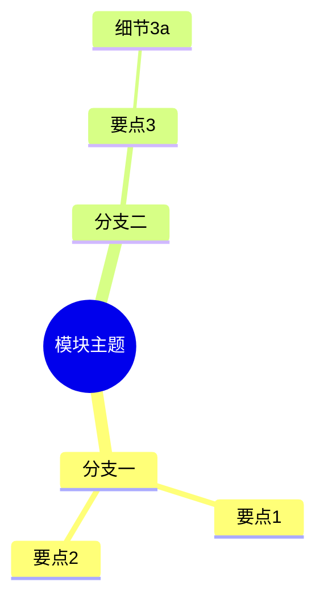

# 可离线交互教学件模式（Interactive Artifacts）

本规范定义三类可离线打开的交互教学件：mindmap、quiz-HTML、code-playground。
共同约定：产出为 `docs/03-labs/<lab>/assets/` 下的资产文件；learner-pack 通过相对路径引用；
浏览器可直接打开、无网络依赖、文件内含用途与使用说明。

## 通用约定

- 产出位置：`docs/03-labs/<lab>/assets/<artifact-name>.<ext>`（一个lab一个目录，资产随lab走）
- learner-pack 引用方式：在 `docs/04-learner-pack/` 对应材料中用相对路径链接，如
  `[课前自测](../03-labs/01-lab-01/assets/quiz-module-01.html)`；打包发布时资产文件随包复制，不改链接
- 教师侧答案/解析放 `docs/05-instructor-pack/`，不得混入学员可打开的交互件
- 验收标准（三类共用）：
  1. 双击或 `start <file>` 可在默认浏览器打开并正常渲染
  2. 断网状态下功能完整（无CDN、无外部字体、无远程脚本）
  3. 文件头部注释或说明区写明：用途、适用课时、操作方式

## ① mindmap（知识结构思维导图）

- 适用场景：模块知识结构总览、课前预习导览、章节小结回扣、概念关系梳理
- 语法模板（mermaid mindmap）：



- 产出形式（二选一或兼有）：
  - `*.md`：内嵌 mermaid mindmap 代码块，供支持 mermaid 的查看器（IDE/GitHub）直接渲染
  - `*.html`：单文件包装，`<script>` 内联 mermaid 库源码后渲染上面的 mindmap 定义，保证浏览器离线直开
- learner-pack 引用：预习材料中链接到该 `.html`（首选，学员零工具可开）或 `.md`
- 验收标准：除通用三条外，节点内容与课程大纲术语一致；分支数控制在 3-6 个，避免认知超载

## ② quiz-HTML（单文件自测题）

- 适用场景：课前摸底自测、课后即时巩固、lab 前置检查（"做对了再动手"）
- 模式：单文件自包含 HTML——题目内联为 JS 数组，点击选项即时反馈对错与一句话解析，零外部依赖
- 骨架示例（10行核心结构）：

```html
<!doctype html><meta charset="utf-8"><title>课前自测</title>
<!-- 用途: 模块01课前自测 | 操作: 点击选项查看即时反馈 -->
<div id="q"></div><div id="fb"></div>
<script>
const BANK=[{q:"问题题干?",opts:["A","B","C"],a:1,why:"一句话解析"}];
let i=0;function r(){const x=BANK[i];q.innerHTML=x.q+"<br>"+x.opts.map((o,j)=>
`<button onclick="c(${j})">${o}</button>`).join("");fb.textContent="";}
function c(j){const x=BANK[i];fb.textContent=(j===x.a?"✔ 正确 ":"✘ 错误 ")+x.why;
if(j===x.a&&i<BANK.length-1){i++;setTimeout(r,800);}}
r();
</script>
```

- learner-pack 引用：在对应 lesson 的"自测"小节直接链接该 `.html`
- 验收标准：除通用三条外，每题有即时反馈与解析；答案解析不泄露后续 lab 的完整答案；题量 3-10 题为宜

## ③ code-playground（可运行代码练习页）

- 适用场景：语法/命令入门练习、小步快跑式编程训练、"改一行看结果"式概念验证
- 模式：单文件 HTML——`<script>` 内嵌可运行示例代码与预置断言练习；学员在 `<textarea>` 改代码后点运行，
  页面用预置断言判定通过/失败并给出提示；不依赖任何远程运行时
- 骨架示例：

```html
<!doctype html><meta charset="utf-8"><title>代码练习</title>
<!-- 用途: lab-02 前置练习 | 操作: 修改代码后点"运行检查" -->
<textarea id="src" rows="6" cols="60">function add(a,b){ return a-b; }</textarea>
<button onclick="run()">运行检查</button><pre id="out"></pre>
<script>
const TESTS=[["add(1,2)",3],["add(5,5)",10],["add(-1,1)",0]]; // 预置断言
function run(){const code=src.value,out=[];try{eval(code);
for(const [expr,want] of TESTS){const got=eval(expr);
out.push((got===want?"PASS ":"FAIL ")+expr+" => "+got+" (期望 "+want+")");}
}catch(e){out.push("运行错误: "+e.message);}document.getElementById("out").textContent=out.join("\n");}
</script>
```

- learner-pack 引用：在 lab guide 的"前置练习"或"随堂练习"小节链接该 `.html`
- 验收标准：除通用三条外，预置断言覆盖练习目标的核心行为；失败提示指出方向而非直接给答案；
  完整正确答案只出现在 instructor-pack

## 与其他skill的边界

- 交互件是 lab 的**资产类型**，lab 的目标/步骤/验收仍由 course-lab-design 主流程定义
- 成体系测评（题库、难度分布、评分标准）归 course-assessment-design，不在本文件范围
